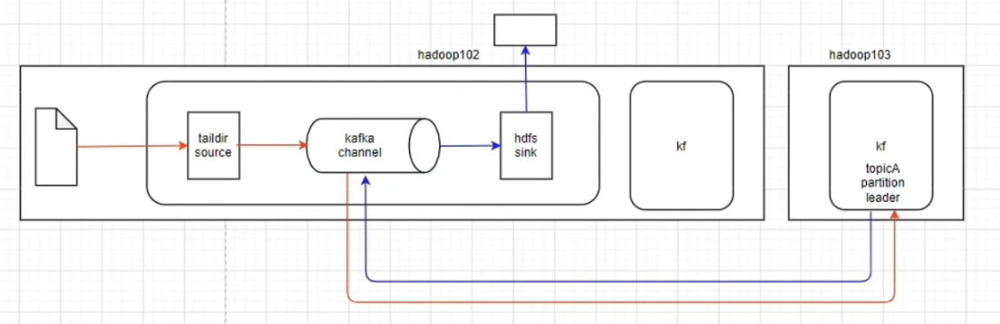
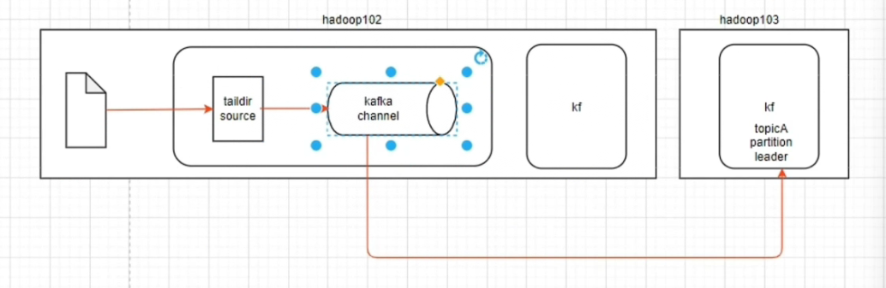
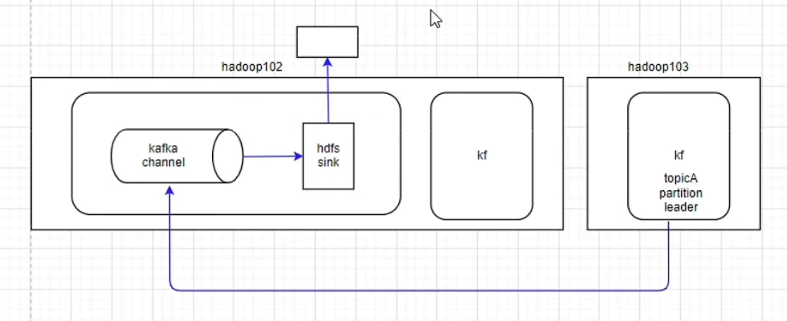

### 0001 常见的flume组件

- source

  - taildir（用的最多）

    实时读取文件数据，支持断点续传

  - avro（其次）

    flume之间互相传输，搭配avro sink使用

  - nc

    接收网络端口

  - exec

    实时读取监控文件数据，但是不支持断点续传

  - spooling

    监控文件夹，支持断点续传，时效性没有特别好

  - kafka

    本质就是kafka的消费者，从kafka的topic中读取数据

- channel

  - file

    基于磁盘，慢，安全，可以利用索引机制优化

  - memory

    基于内存，快，但数据易丢，不安全

  - kafka（多）

    需要单独安装kafka集群

    - 结合source和sink使用（一般不直接用）

      

    - 结合source和intercept拦截器使用

      

    - 不需要source，直接从kafka读取数据

      

- sink 

  - hdfs

  - kafka

    本质就是kafka的生产者，将数据写入kafka的topic中

  - avro