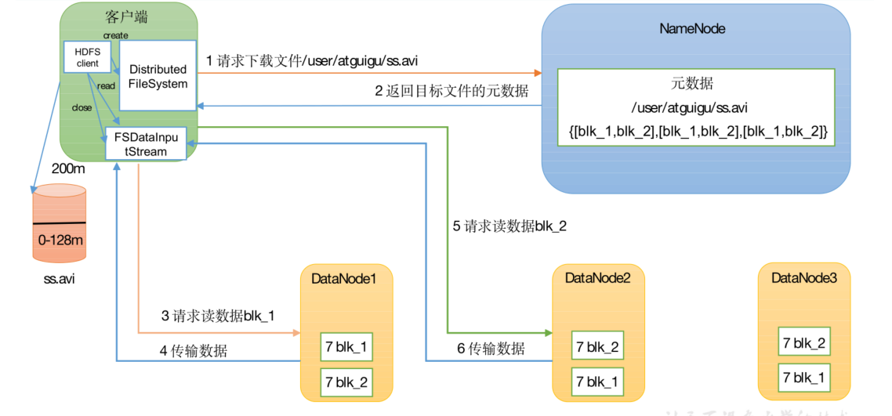
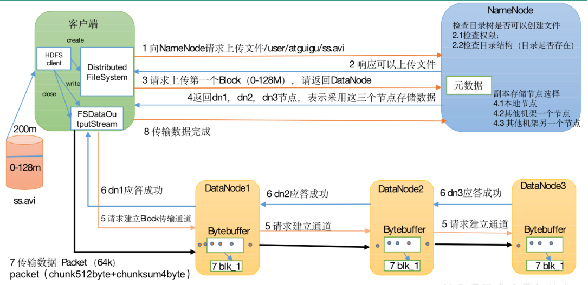
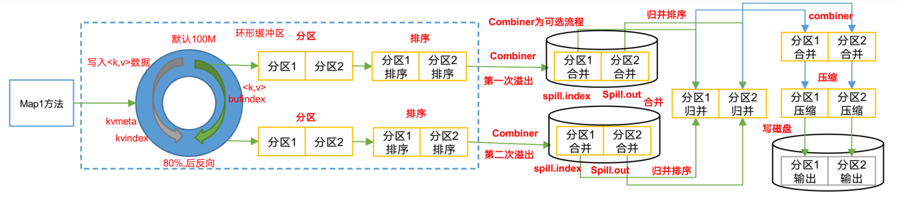
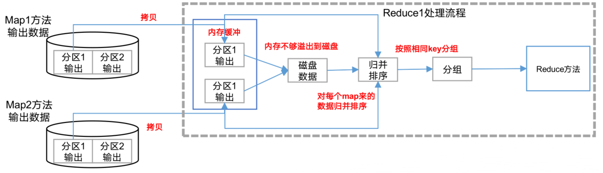
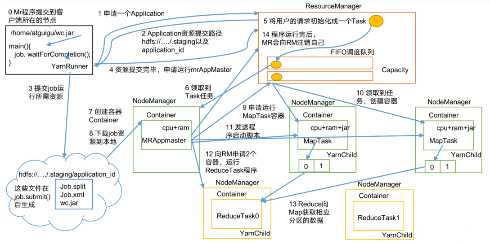

### 0001 常用端口号


|                     | Hadoop2.x | Hadoop3.x |
| ------------------- | --------- | --------- |
| 访问HDFS端口        | 50070     | 9870      |
| 访问 MR执行情况端口 | 8088      | 8088      |
| 历史服务器          | 19888     | 19888     |
| 客户端访问集群端口  | 9000      | 8020      |

9870  8080  19888  9000/9820/8020

### 0002 常用配置文件

core-site.xml	hdfs-site.xml	mapred-site.xml	yarn-site.xml	workers

### 0003 小文件的危害和处理方式

1.存储危害

每个小文件都会占用NameNode150字节内存	128G约存9亿小文件元数据

2.计算危害

默认切片规则下，每个小文件都会开启一个maptask，1个MapTask默认1G内存

解决方式：

```java
// 1.Har归档

// 2.CombineTextInputFormat

// 3.JVM重用
```

### 0004 block块大小

1.x		64M

2.x		128M

本地		32M

企业		128/256/512M

### 0004 HDFS 读写过程（笔试题）





### 0005 shuffle 过程及优化



map侧shuffle：map 输出不会直接输出到磁盘，每个map任务都会被分配一个缓存区，缓存区中的数据进行分区、排序、合并等操作，每当缓存容量快被占满时，就会启动溢写，将缓存的内容一次性写入磁盘，并清空缓存，每次溢写操作都会生成一个溢写文件，map任务结束前，会对所有溢写文件进行归并，生成一个大的溢写文件

优化方式：

1. 自定义分区，减少数据倾斜

   定义类，实现Partition 接口，重写getPartition方法

2. 减少溢写的次数

   1. mapreduce.task.io.sort.mb   Shuffle的环形缓冲区大小，默认100m，可以提高到200m
   2. mapreduce.map.sort.spill.percent 环形缓冲区溢出的阈值，默认80% ，可以提高的90%

3. 增加每次Merge合并数

   mapreduce.task.io.sort.factor默认10，可以提高到20

4. 为了减少磁盘IO ，可以采用Snappy 或者LZO 压缩

   conf.setBoolean("mapreduce.map.output.compress", true);
   conf.setClass("mapreduce.map.output.compress.codec",
   SnappyCodec.class,CompressionCodec.class);

5. 增加MapTask 内存上限、控制MapTask堆内存大小、增加MapTask的CPU核数

   mapreduce.map.memory.m

   mapreduce.map.java.opts

   mapreduce.map.cpu.vcores



reduce侧的shuffle：将前面的map输出结果按照分区发送到不同的reduce任务上，领取的数据也是先存到缓存区，然后溢写，最后归并

优化方式：

1. mapreduce.reduce.shuffle.parallelcopies每个Reduce去Map中拉取数据的并行数，默认值是5。可以提高到10。
2. mapreduce.reduce.shuffle.input.buffer.percent Buffer大小占Reduce可用内存的比例，默认值0.7。可以提高到0.8
3. mapreduce.reduce.shuffle.merge.percent Buffer中的数据达到多少比例开始写入磁盘，默认值0.66。可以提高到0.75
4. ReduceTask内存上限、ReduceTask堆内存大小、ReduceTask的CPU核数

### 0006 Yarn工作机制



0. MR程序提交到客户端所在节点
1. 客户端向RM申请一个Application
2. RM向客户端返回资源提交路径，以及app_id
3. 客户端向指定路径提交job运行所需资源（包括Jar包，xml，切片信息）
4. 提交完毕后客户端向RM申请运行MRAppMaster
5. RM将用户请求初始化成一个Task，置入调度器MR
6. NM从调度器处领到任务
7. NM创建容器Container运行MRAppMaster
8. MRAppMaster下载job资源到本地
9. MRAppMaster申请运行MapTask容器
10. 空闲NM领取任务创建容器运行MapTask
11. MRAppMaster向MapTask发送程序启动脚本
12. MRAppMaster向RM申请容器运行ReduceTask
13. ReduceTask向MapTask获取相应分区的数据
14. 程序运行完后向RM注销自己
