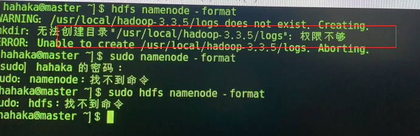
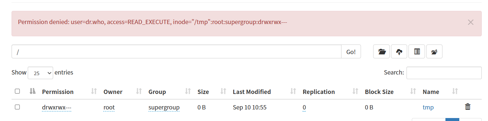

### 0001  ip地址能ping同，主机名不能

说明主机名映射有问题，检查hosts文件

### 0002 Failed to start LSB: Bring up/dowm networking .

网卡启动失败


```sh
#禁用NetworkManager(网络管理器)
#关闭NetworkManager服务,重启机器后会失效
 systemctl stop NetworkManager
#永久关闭NetworkManager服务,重启机器后不会失效 (内网机器建议永久关闭)
 systemctl disable NetworkManager
```

### 0003 格式化NameNode 失败



权限不够 sudo chmod -R a+w hadoop安装路径

### 0004 启动hadoop后没有namenode

说明namenode没有成功格式化

### 0005 Windows 端hosts无法更改

在外面改了再覆盖进来

### 0006 hadoop网页端hdfs无权限



hdfs dfs -chmod -R 755 /

### 0007 Error: Could not find or load main class org.apache.hadoop.mapreduce.v2.app.MRAppMaster

```sh
hadoop classpath
```

```xml
    <property>
       <name>yarn.application.classpath</name>
       <value>
		  /software/hadoop/etc/hadoop:/software/hadoop/share/hadoop/common/lib/*:/software/hadoop/share/hadoop/common/*:/software/hadoop/share/hadoop/hdfs:/software/hadoop/share/hadoop/hdfs/lib/*:/software/hadoop/share/hadoop/hdfs/*:/software/hadoop/share/hadoop/mapreduce/*:/software/hadoop/share/hadoop/yarn:/software/hadoop/share/hadoop/yarn/lib/*:/software/hadoop/share/hadoop/yarn/*
      </value>
    </property>
<property>
	<name>yarn.app.mapreduce.am.env</name>
    <value>HADOOP_MAPRED_HOME=${HADOOP_HOME}</value>
</property>
<property>
	<name>mapreduce.map.env</name>
    <value>HADOOP_MAPRED_HOME=${HADOOP_HOME}</value>
</property>
<property>
	<name>mapreduce.reduce.env</name>
    <value>HADOOP_MAPRED_HOME=${HADOOP_HOME}</value>
</property>
```

yarn-site.xml，mapred-site.xml

### 0008  没有datanode

可能是clusterID不一致，删除/data/hadoop/hdfs/里的内容

然后重新格式化namenode

hadoop namenode -format

### 0009 卡在资源分配界面 running  jar

重启hadoop集群后看有没有进程缺失，缺少datanode和datamanager参考0008

### 0010 Hadoop启动时提示权限问题（Permission denied）


```sh
ssh-keygen -t rsa
# 在之后跳出的文字交互界面一路回车+yes即可
cat id_rsa.pub >> authorized_keys
# 将公钥追加到authorized_keys文件中去
chmod 600 authorized_keys
# 将authorized_keys文件权限更改为600
# 至此设置免密操作完毕
```

