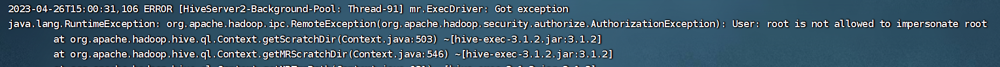
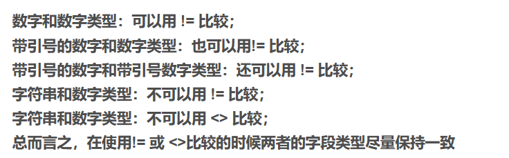

### 0001 映射结构化数据去表头

```sql
create table(id int ,name string)
row format delimited
fields terminated by ','
tblproperties ("skip.header.line.count"="1");
```

### 0002 从文件加载数据到表

```hive
load data local inpath '/root/a.txt' into table a;
```

### 0003 insert报错

```shell
 [08S01][1] Error while processing statement: FAILED: Execution Error, return code 1 from org.apache.hadoop.hive.ql.exec.mr.MapRedTask
```

查看hive日志发现是root根目录权限问题



在core-site.xml里添加

```xml
<property>
    <name>hadoop.proxyuser.xxx.hosts</name>
    <value>*</value>
</property>
<property>
    <name>hadoop.proxyuser.xxx.groups</name>
    <value>*</value>
</property>
```

之前没有解决是因为property敲错了！！！！

### 0004 [字符串函数](https://blog.csdn.net/qq_34941023/article/details/51550004)

contains(a,b) 判断a中是否包含b

### 0005 != 和<>的区别

在关系型数据库中两者几乎相等，但在Hive中两者有区别



### 0006 like 和rlike

```sql
-- like语法匹配
  % 代表零个或多个字符(任意个字符)。
  _ 代表一个字符
如：查找名字中第二个字母为A的员工信息：
select * from emp where ename LIKE '_A%';

rlike正则匹配
  可以通过Java的正则表达式来指定匹配条件
   ^ 符号表示匹配以给定模式开头的字符串，$ 符号表示匹配以给定模式结尾的字符串

[a-z] // 匹配所有的小写字母 
[A-Z] // 匹配所有的大写字母 
[a-zA-Z] // 匹配所有的字母 
[0-9] // 匹配所有的数字 
[0-9\.\-] // 匹配所有的数字，句号和减号 
[ \f\r\t\n] // 匹配所有的白字符

如：查找名字中带有A的员工信息：
select * from emp where ename  RLIKE '[A]';
查找名字以FOR开头的员工信息：
select * from emp where ename  RLIKE '^FOR';
```

### 0007 Hive中没有left()和right()函数！！

如果需要可以使用substring（）代替

### 0008 Ambiguous column reference

子查询中出现了重复字段

### 0009 ParseException **** cannot recognize input near **** in joinSource

检查是否是子查询未加别名
