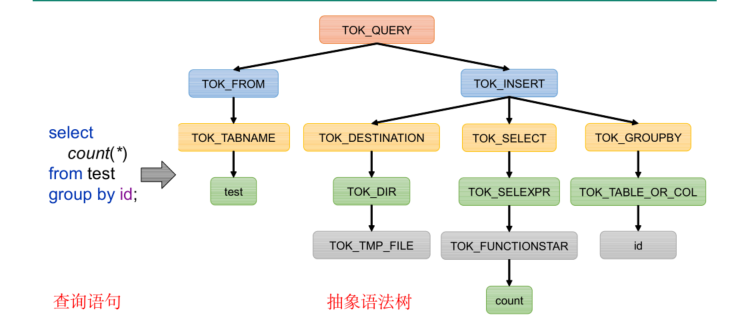
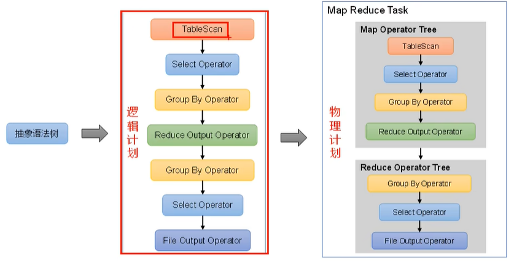
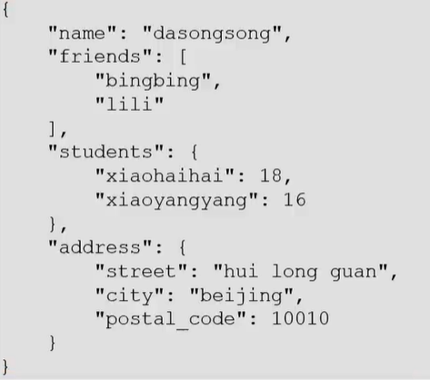
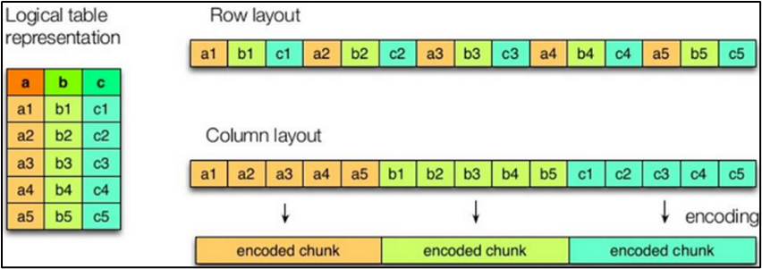
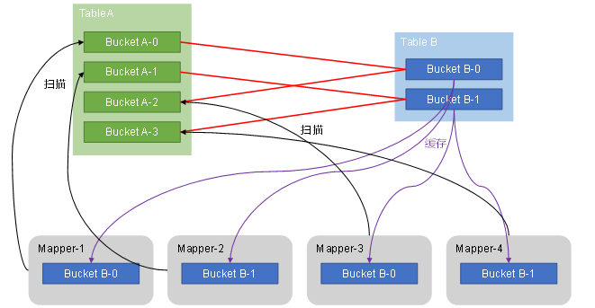
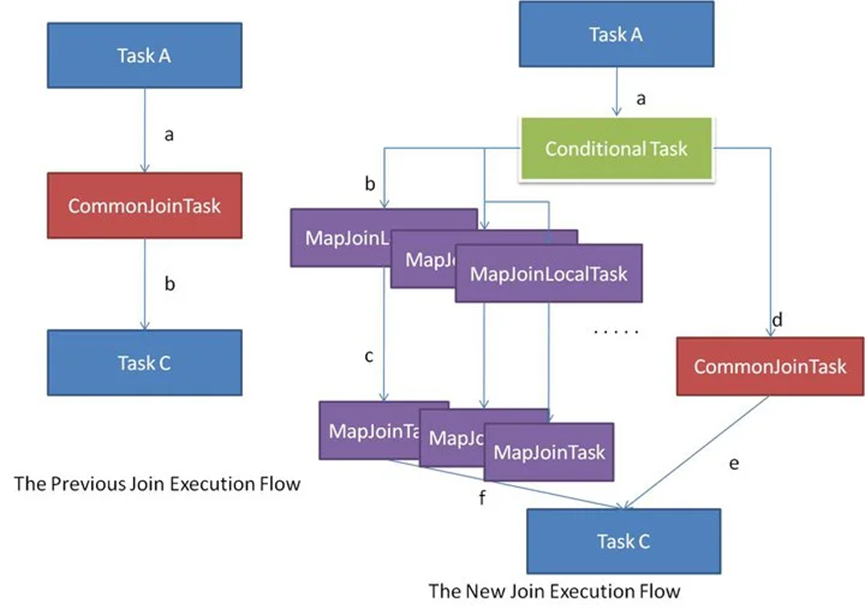
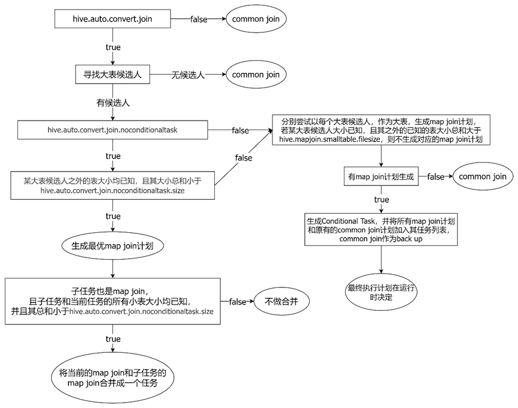

### 0001 映射结构化数据去表头

```hive
create table(id int ,name string)
row format delimited
fields terminated by ','
tblproperties ("skip.header.line.count"="1");
```

### 0002 从文件加载数据到表

```hive
load data local inpath '/root/a.txt' into table a;
```

### 0003 insert报错

```shell
 [08S01][1] Error while processing statement: FAILED: Execution Error, return code 1 from org.apache.hadoop.hive.ql.exec.mr.MapRedTask
```

查看hive日志发现是root根目录权限问题


在core-site.xml里添加

```xml
<property>
    <name>hadoop.proxyuser.xxx.hosts</name>
    <value>*</value>
</property>
<property>
    <name>hadoop.proxyuser.xxx.groups</name>
    <value>*</value>
</property>
```

之前没有解决是因为property敲错了！！！！

### 0004 字符串函数

contains(a,b) 判断a中是否包含b

### 0005 != 和<>的区别

在关系型数据库中两者几乎相等，但在Hive中两者有区别


### 0006 like 和rlike

```sql
-- like语法匹配
  % 代表零个或多个字符(任意个字符)。
  _ 代表一个字符
如：查找名字中第二个字母为A的员工信息：
select * from emp where ename LIKE '_A%';

rlike正则匹配
  可以通过Java的正则表达式来指定匹配条件
   ^ 符号表示匹配以给定模式开头的字符串，$ 符号表示匹配以给定模式结尾的字符串

[a-z] // 匹配所有的小写字母 
[A-Z] // 匹配所有的大写字母 
[a-zA-Z] // 匹配所有的字母 
[0-9] // 匹配所有的数字 
[0-9\.\-] // 匹配所有的数字，句号和减号 
[ \f\r\t\n] // 匹配所有的白字符

如：查找名字中带有A的员工信息：
select * from emp where ename  RLIKE '[A]';
查找名字以FOR开头的员工信息：
select * from emp where ename  RLIKE '^FOR';
```

### 0007 Hive中没有left()和right()函数！！

如果需要可以使用substring（）代替

### 0008 Ambiguous column reference

子查询中出现了重复字段

### 0009 ParseException **** cannot recognize input near **** in joinSource

检查是否是子查询未加别名

### 0010 当使用order by 排序时顺序不对

检查排序字段的数据类型，常见的错误是数字为string类型，不能当作int排序

### 0011 不能直接使用int型字段作case when 的判断条件

```sql
case when （boolean）then  e1	else	e2
```

### 0012 查看Hive中表的所有信息

```sql
# 1.查询创建表的信息
show create table <>
# 2.查询表的字段信息
desc <>
# 3.表详细属性信息
desc formatted <>
# 4.表详细信息
describe extended <>
# 5.表分区信息
show partitions <>

```

### 0013 详细建表语句

```hive
CREATE [TEMPORARY] [EXTERNAL] TABLE [IF NOT EXISTS] [db_name.]table_name    -- (Note: TEMPORARY available in Hive 0.14.0 and later)
  [(col_name data_type [COMMENT col_comment], ... [constraint_specification])]
  [COMMENT table_comment]
  [PARTITIONED BY (col_name data_type [COMMENT col_comment], ...)]
  [CLUSTERED BY (col_name, col_name, ...) [SORTED BY (col_name [ASC|DESC], ...)] INTO num_buckets BUCKETS]
  [SKEWED BY (col_name, col_name, ...)                  -- (Note: Available in Hive 0.10.0 and later)]
     ON ((col_value, col_value, ...), (col_value, col_value, ...), ...)
     [STORED AS DIRECTORIES]
  [
   [ROW FORMAT row_format] 
   [STORED AS file_format]
     | STORED BY 'storage.handler.class.name' [WITH SERDEPROPERTIES (...)]  -- (Note: Available in Hive 0.6.0 and later)
  ]
  [LOCATION hdfs_path]
  [TBLPROPERTIES (property_name=property_value, ...)]   -- (Note: Available in Hive 0.6.0 and later)
  [AS select_statement];   -- (Note: Available in Hive 0.5.0 and later; not supported for external tables)
 
CREATE [TEMPORARY] [EXTERNAL] TABLE [IF NOT EXISTS] [db_name.]table_name
  LIKE existing_table_or_view_name
  [LOCATION hdfs_path];
 
data_type
  : primitive_type
  | array_type
  | map_type
  | struct_type
  | union_type  -- (Note: Available in Hive 0.7.0 and later)
 
primitive_type
  : TINYINT
  | SMALLINT
  | INT
  | BIGINT
  | BOOLEAN
  | FLOAT
  | DOUBLE
  | DOUBLE PRECISION -- (Note: Available in Hive 2.2.0 and later)
  | STRING
  | BINARY      -- (Note: Available in Hive 0.8.0 and later)
  | TIMESTAMP   -- (Note: Available in Hive 0.8.0 and later)
  | DECIMAL     -- (Note: Available in Hive 0.11.0 and later)
  | DECIMAL(precision, scale)  -- (Note: Available in Hive 0.13.0 and later)
  | DATE        -- (Note: Available in Hive 0.12.0 and later)
  | VARCHAR     -- (Note: Available in Hive 0.12.0 and later)
  | CHAR        -- (Note: Available in Hive 0.13.0 and later)
 
array_type
  : ARRAY < data_type >
 
map_type
  : MAP < primitive_type, data_type >
 
struct_type
  : STRUCT < col_name : data_type [COMMENT col_comment], ...>
 
union_type
   : UNIONTYPE < data_type, data_type, ... >  -- (Note: Available in Hive 0.7.0 and later)
 
row_format
  : DELIMITED [FIELDS TERMINATED BY char [ESCAPED BY char]] [COLLECTION ITEMS TERMINATED BY char]
        [MAP KEYS TERMINATED BY char] [LINES TERMINATED BY char]
        [NULL DEFINED AS char]   -- (Note: Available in Hive 0.13 and later)
  | SERDE serde_name [WITH SERDEPROPERTIES (property_name=property_value, property_name=property_value, ...)]
 
file_format:
  : SEQUENCEFILE
  | TEXTFILE    -- (Default, depending on hive.default.fileformat configuration)
  | RCFILE      -- (Note: Available in Hive 0.6.0 and later)
  | ORC         -- (Note: Available in Hive 0.11.0 and later)
  | PARQUET     -- (Note: Available in Hive 0.13.0 and later)
  | AVRO        -- (Note: Available in Hive 0.14.0 and later)
  | JSONFILE    -- (Note: Available in Hive 4.0.0 and later)
  | INPUTFORMAT input_format_classname OUTPUTFORMAT output_format_classname
 
constraint_specification:
  : [, PRIMARY KEY (col_name, ...) DISABLE NOVALIDATE ]
    [, CONSTRAINT constraint_name FOREIGN KEY (col_name, ...) REFERENCES table_name(col_name, ...) DISABLE NOVALIDATE 
     
   
create database [if not exists] 数据库名 
[comment '备注']
[LOCATION hdfs_path] --默认为 hive.metastore.warehouse=user/hive/warehouse/
[WITH DBPROPERTIES (属性名=属性值)]
     
     
create [temporary] [external] table [if not exists] [库名.]表名 ( --temporary 临时表，会话结束后删除
	字段名 字段类型 [comment '备注']，		-- external 外部表，hive只管理元数据，删除表不会删除数据，只会删除元数据
    id INT [comment '备注'],
    ...
)
[comment '备注']
[partition by(字段名 字段类型 [comment '备注'],...)]		--分区
[cluster by(字段名,...) [sorted by(字段名 [asc| desc],...)] into 桶数 buckets --分桶
[row format delimited] --默认为SERDE，指定一行数据如何序列化/解析
 					 --使用delimited 表示对每个字段按照特定分割符进行分割			   	
[stored as 文件类型]    --默认INPUTFORMAT和OUTPUTFORMAT，指定文件如何解析
 					 --默认为textfile，还有sequence file、orc file、 parquet file
[LOCATION hdfs_path]   --默认为 hive.metastore.warehouse=user/hive/warehouse/下的库目录下
[WITH TBLPROPERTIES (属性名=属性值,...)]
```

### 0014 Hive驱动器Driver

1. 解析器（SQL Parser）：将SQL字符转换成抽象语法树(AST)

   

2. 语义分析（Semantic Analyzer）：将AST进一步划分为QueryBlock（可以理解为一个子查询划分成一个 QueryBlock）

3. 逻辑计划生成器（Logical Plan Gen）由 QueryBlock 生成逻辑计划



4. 逻辑优化器（Logical Optimizer）：对逻辑计划进行优化，比如先执行filter
5. 物理计划生成器（Physical Plan Gen）：根据优化后的逻辑计划生成物理计划
6. 物理优化器（Physical Optimizer）：对物理计划进行优化，比如join->map join
7. 执行器（Execution）：执行该计划，得到查询结果并返回给客户端

### 0015 常见参数配置

配置方式

```shell
# 1.修改配置文件 hive-site.xml  全局有效

# 2.命令行传参 hive -hiveconf xxx.xxx.xxx=xx  本次启动有效

# 3.在hive进程里修改 set xxx.xxx.xxx=xx 进程中有效set 属性名 可以返回当前属性值
```

属性说明


```shell
# 1.hive客户端 hive-site.xml
hive.cli.print.header=true	# 显示表头
hive.cli.print.current.db	# 显示当前所在数据库
hive.server2.enable.doAs=true  # 模拟用户功能
# 2.Hive的JVM堆内存设置 hive-env.sh
HADOOP_HEAPSIZE
```

### 0015 常见命令

```shell
hive -e "SQL语句"  # 执行语句
hive -f 文件名  # 执行SQL文件
```

### 0016 数据库相关操作（DDL）

```hive
-- 展示所有数据库
show database[like "db*"] --*表示任意个字符，|表示或的关系
-- 查看数据库信息
desc database [extended]数据库名
-- 修改数据库
alter database 数据库名 set dbproperties等
-- 如果修改的是location 代表的是后续在这个数据库下新建的表的父目录，不影响已有的表
-- 删除数据库
drop database [if exists] 数据库名 [restrict|cascade]
-- restrict 严格模式，数据库不为空会删除失败
-- cascade 级联模式，数据库不为空，则将库中表一并删除
-- 切换
use 数据库名
```

### 0017 建表行格式delimited语法

```hive
row format delimited
[fields terminated by 字符]			--列分隔符
[collection items terminated by 字符]	 --map\struct\array中每个元素之间的分隔符	
[map keys terminated by 字符]			--map中key、value的分隔符
[lines terminated by 字符]			--行分隔符
[null defined as 字符]				--将扫描到的该字符定义为NULL值
```

### 0018 其他建表语句

```hive
--1 Create Table As Select（CTAS）建表，使用查询结果建表，表结构查询结果保持一致，内容也一致
create [temporary] table [if not exists] 表名 --只能建立内部表
[comment '备注']
[row format 序列化格式] 	   	
[stored as 文件类型] 
[LOCATION hdfs_path]   --默认为 hive.metastore.warehouse=user/hive/warehouse/下的库目录下
[TBLPROPERTIES (属性名=属性值,...)]
[as select查询语句]

--2 Create table like 复刻一张已存在的表的表结构，创建出来的表是空表
create [temporary] [external] table [if not exists] [库名.]表名 
[like 存在的表名]
[row format delimited] 
[stored as 文件类型]    
[LOCATION hdfs_path]   
[TBLPROPERTIES (属性名=属性值,...)]
```

建表练习，将以下json文件设计成表，每个json字符串为一行



```hive
create table [temporary] [external] if not exists teachers(
	name string,
    friends array<string>,
    students map<string,int>,
    address struct<street:string,city:string,postal_code:int>
)
row format serde 'org.apache.hadoop.hive.serde2.JsonSerDe'
location '/user/hive/warehouse/**'
```

### 0019 hive连接hiveServer2失败，启动hivesever2，10000没有启动

可以看看启动日志，修改/hive/conf/下的hive-log4j2.properties.temporary, 然后给一个log地址，就可以查看日志了

我的问题是之前使用ranger管理之后，ranger删除了，但是ranger在hiveserver2-site.xml中的配置还在，导致启动失败

如果遇到java.lang.ClassNotFoundException: org.apache.tez.dag.api.TezConfiguration

则在配置文件hive-site.xml中的hive.execution.engine属性值由tez修改为mr

### 0020 查看表信息

```hive
1. show tables [in database_name] [like table_name]
2. describe [extended| formatted] table_name 
extended 显示详细信息， formatted 详细信息格式化显示，两者只能用一个
```

### 0021 修改表信息

```hive
-- 所有操作只针对表结构，不能改变已有hdfs数据
1. 更改表名
alter table tbl_name rename to new_name;
2. 修改列信息
alter table tbl_name add columns (col_name col_type,...) --新增列,位置在列末尾
alter table tbl_name change [column] old_name new_name col_type [first | after col_name]-- first最前，after在某列后
-- 不兼容的时候可以加set hive.metastore.disallow.incompatible.col.type.changes=false;
alter table tbl_name replace columns (col_name col_type,...)
```

### 0022 hive 的DML操作

hive中很少用到修改和删除（update和delete）（truncate和drop是ddl操作）

```hive
-- 1. load 将文件加载到Hive表中
load data [local] inpath 'filepath' [overwrite] into table tbl_name [partition(pcol1=val1,...)]
-- local 指的是cli客户端的本地或者是jdbc客户端的hiveserver2所在的机器，从本地加载会复制到hdfs上
-- 没有local的情况下，会直接移动hdfs上的文件到表所在路径

-- 2. insert 
-- 2.1 将查询结果插入到表中（最为常用）
insert into| overwrite table tbl_name [partition(...)] select语句
-- 2.2 将给定value插入到表中
insert into| overwrite table tbl_name [partition(...)] values(col_val1,col_val2),(...),...
-- 2.3 将查询结果写入目标路径
insert overwrite [local] directory path [row format 行格式] [stored as 文件格式] select语句
-- 只能使用overwrite，与创建表相反，将查询结果存为文件，路径尽量写空路径，不然路径会被全覆盖

-- 3. Export&Import 不同的hive实例之间的数据迁移，import必须使用export导出的路径
export table tbl_name to 'exp_path'
import [external] table new_tbl_name from 'old_path' [location 'new_path']
```

### 0023 查询语句

```hive
select [all| distinct] 
from tbl_name
[where]
[group by]
[having]
[order by]
[cluster by]
[distribute by]
[sort by]
```

### 0024 limit 语句

```hive
select * from tb limit 5; -- 选取前五行
select * from tb limit 2,3; -- 从第2行开始，向下选取3行
```

### 0025 hive基本关系运算函数

```hive
1. =,>,< 略
2. <>, != 不等于
3. <=> 判空等于左右都为null或者都不为null，返回true，否则返回false
4. [not] between a and b 
5. is [not] null
6. in(a,b,...)
7. a [not] like b --b为简单正则表达式（通配符模式），%表示任意多字符，_表示一个字符
8. a rlike b, a regexp b -- b是基于java的正则表达式，参照SQL中的正则表达式
```

### 0026 聚合函数

把多行数据聚合在一起计算返回一个数

```hive
1. count() 	--count(*) 包含null，count(某列) 不包含null
2. max()	--不包含null，除非所有为null
3. min()	--不包含null，除非所有为null
4. sum()	--不包含null
5. avg()	--不包含null
```

### 0027 out of memoryError: Java heap space

```shell
# 堆内存溢出，可以尝试修改hive-env.sh
 HADOOP_HEAPSIZE值调大
# 本地运行测试时可以不用上传到yarn
set mapreduce.framework.name = local
```

### 0028  join 

两表之间横向拼接

```hive
1. [inner] join  	-- 内连接，只保留能连接的数据
2. left join	-- 左表的所有数据保留
3. right join
4. full outer join --保留所有列
-- 如果省略连接条件或者连接条件无效，会产生笛卡尔积，要避免
-- union 和union all 则是纵向拼接，union会合并相同项，union all 会保留重复数据，union要求字段数量和类型保持一致，字段名以第一个表为准
```


### 0029 四个by

```hive
order by 	-- 高危操作，全局排序，指定reduce数量无效,在一个reduce中进行，一般后面会加 limit
sort by 	-- reduce 内部排序
distribute by -- 指定分区字段
cluster by 相当于 sort by distribute by --指定某字段分区并根据该字段分区排序
```

### 0030 常用函数

```hive
-- 1. 数值函数+-*/略
a%b 	--a对b取余
a&b		--按位与
a|b		--按位或
a^b		--按位异或
~a		--取反
-- 2. 数值函数
round(a,2)		--四舍五入，保留2位
ceil(a)			--向上取整
floor(a)		--向下取整
-- 3. 字符串函数
substring(str, pos [, len])		-- 截取str从pos位置开始的len长度的字符串，pos为负数则倒着数
replace(strA,strB,strC)			-- 将字符串strA中的strB替换为strC
regexp_replace(strA,strB)		-- strB是正则表达式
a regexp b					   -- a满足b返回true
repeat(strA ,intB) 			    -- 把strA重复intB遍
split(strA, strB)			    -- 以strB作为分隔符切割strA，strB是正则表达式，分隔符不能直接用正则关键字,返回数组
nvl(col_name,0)				    -- 如果为null，返回0
concat(strA,strB,...)			-- 拼接传入的字符串， ||也可以拼接字符串
concat_ws(str, strA, strB,...)	 -- str作为分隔符拼接后面的字符串
get_json_object(jsonStr, strPath)	
例：get_json_object(a,"$[1]")    -- 取a中的第一个对象/元素	
-- 4. 日期函数/时间函数
unix_timestamp()		--返回当前时间戳或指定时间的时间戳UTC,unixtime,可能为10位或13位
from_unixtime(bigint unixtime,[string format])
current_date()			-- 返回当前日期
current_timestamp()		--返回当前时区"yyyy-MM-dd HH:mm:ss"格式时间戳
month(),day(),year(),hour(),minute(),second()
datediff(dateA,dateB)	--返回A-B的天数
date_add(date A, string days)	--返回A+days后的日期
date_sub()
date_format(date A, string format)	--"yyyy-MM-dd HH:mm:ss" ,MySQL中格式为"%y-%m-%d %h:%m:%s"
-- 5.流程控制函数
case when boolean表达式 then a else b end
if(boolean, a, b)
-- 6. 集合函数
array() 							-- 构造器
array_contains(array a, obj b)		  -- 判断a中包不包含b
sort_array(array a)					 -- 只能升序排序
size_array(array a)					 -- 返回集合元素数
map(key1,value1,key2,value2,...)	  
map_keys(),map_values
struct(val1,val2,...)				 -- 字段名为默认的col_1,col_2,...
named_struct(name1,val1,name2,val2,...)
```

### 0031 UDTF

（User Defined Table-Generating Function）

生成表结构的函数，接收一行数据，输出一行或多行数据

```hive
-- 1. explode() 	将数组转换成多行数值，或将map转换成多行key，value表
-- 2. posexplode()	将数组转换成多行数值和位置，只能传入数组
-- 3. inline()		传入struct数组
-- 4. lateral view   与udtf结合，将某个字段的炸裂应用到全表,生成一个view
例：
select id, hobbies, hobby
from person lateral view explode(hobbies) tmp as hobby

select cat, count(*)
from movie_info lateral view explode(split(category,',') tmp as cat
group by cat
```

### 0032 窗口函数

为每行数据划分一个窗口，对窗口内范围的数据进行计算，最后将计算结果返回给该行

```hive
-- 基础语法 函数+窗口范围
select *, fun（col_name） over（窗口范围）别名 from tbl_name
-- 绝大多数的聚合函数都可以配合窗口函数使用
-- 窗口范围分为基于行和基于值的
-- 基于行 
over(order by col_name rows between A and B) -- A unbounded preceding/[num] preceding/current row/[num] following 
-- unbounded preceding 从起点开始 /[num] preceding 前num行/[num] following 后num行
-- unbounded following 到终点结束
-- 基于值
over(order by col_name range between A and B) -- 这里的num preceding/following,num代表的是col_name值的加减，有num的时候col_name必须是整数类型

-- 窗口分区 ,窗口内分区计算
over(partition by col_name order by col_name row between A and B)

-- 缺省
partition by --省略则不分区
order by 	-- 省略不排序，除非计算所有行的，不然一般不省略
(rows| range) between	-- order by 不写则没有意义，默认是range
-- 有order by 则是起点到当前行，没有order by 则是起点到终点

```

```hive
-- 1.跨行取值
-- lead()、lag(),获取当前行下、上某行的值，不支持自定义窗口，相当于基于行
lead(字段名，偏移量，默认值)
lead(order_date,1,'9999-12-31') over (partition by user_id order by order_date) next_date
-- first_value()、last_value()   false 表示不跳过null值
first_value(order_date, false) over(partition by user_id order by order_date) first_date

-- 2.排名函数 rank()、dens_rank()、row_number() ，不支持自定义窗口
rank() 阶梯排名 ，dense_rank() 连续排名， row_number()自增排序，有并列排名时体现区别
```

### 0033 统计连续多少天

```hive
-- 2.查询订单信息表(order_info)中最少连续3天下单的用户id
-- 思路一：看后两行到今天的时间是不是相差两天
select distinct user_id from
(select user_id, datediff(lead(create_date,2,create_date) over (partition by user_id order by create_date),create_date) sub
from
(
    select user_id,create_date
    from order_info
    group by user_id, create_date
)t)tt
where sub>=2;

-- 思路二：分区后排序，看相等的数量有没有达到三个
select distinct user_id from
(
    select user_id,sub
    from
        (select user_id,create_date, date_sub(create_date,row_number() over (partition by user_id order by create_date)) sub
         from
             (
                 select user_id,create_date
                 from order_info
                 group by user_id, create_date
             )t)t
    group by user_id,sub
    having count(*)>=3
)t;

-- 方案三：范围选取前一行和后一行，然后count统计结果
select distinct user_id
from
(
    select user_id, count(*) over(partition by user_id order by t
        range between 86400 preceding and 86400 following ) cnt
    from
        (
            select user_id,unix_timestamp(create_date,'yyyy-mm-dd') t
            from order_info
            group by user_id, create_date
        )t
)t
where cnt>=3
```

0034 百分号保留一位小数

```hive
concat(round(avg(flag)*100,1),'%')
```

### 0035 自定义函数

UDF、UDAF、UDTF

创建一个maven工程

```xml
<dependencies>
	<dependency>
		<groupId>org.apache.hive</groupId>
		<artifactId>hive-exec</artifactId>
		<version>3.1.3</version>
	</dependency>
</dependencies>
```

继承继承Hive提供的类

org.apache.hadoop.hive.ql.udf.generic.GenericUDF

org.apache.hadoop.hive.ql.udf.generic.GenericUDTF;

实现抽象方法

```java
package com.atguigu.hive.udf;

import org.apache.hadoop.hive.ql.exec.UDFArgumentException;
import org.apache.hadoop.hive.ql.exec.UDFArgumentLengthException;
import org.apache.hadoop.hive.ql.exec.UDFArgumentTypeException;
import org.apache.hadoop.hive.ql.metadata.HiveException;
import org.apache.hadoop.hive.ql.udf.generic.GenericUDF;
import org.apache.hadoop.hive.serde2.objectinspector.ObjectInspector;
import org.apache.hadoop.hive.serde2.objectinspector.primitive.PrimitiveObjectInspectorFactory;

/**
 * 我们需计算一个要给定基本数据类型的长度
 */
public class MyUDF extends GenericUDF {
    /**
     * 判断传进来的参数的类型和长度
     * 约定返回的数据类型
     */
    @Override
    public ObjectInspector initialize(ObjectInspector[] arguments) throws UDFArgumentException {
	// 初始化校验，校验输入数据类型，给出返回值类型
        if (arguments.length !=1) {
            throw  new UDFArgumentLengthException("please give me  only one arg");
        }

        if (!arguments[0].getCategory().equals(ObjectInspector.Category.PRIMITIVE)){
            throw  new UDFArgumentTypeException(1, "i need primitive type arg");
        }

        return PrimitiveObjectInspectorFactory.javaIntObjectInspector;
    }

    /**
     * 解决具体逻辑，每一行数据的计算方式
     */
    @Override
    public Object evaluate(DeferredObject[] arguments) throws HiveException {

        Object o = arguments[0].get();
        if(o==null){
            return 0;
        }

        return o.toString().length();
    }

    @Override
    // 用于获取解释的字符串
    public String getDisplayString(String[] children) {
        return "";
    }
}
```

打成jar包之后，在hive里加载，并创建函数

```hive
-- 创建临时函数
add jar jarPath;
create temporary function fun_name as 'funFullPath'
drop temporary function my_len;

-- 创建永久函数
-- 需要将jar包上传到HDFS
create function fun_name
as "dunFullPath"
using jar "hdfsFilePath"

```

### 0036 分区表

```hive
-- 创建
create table tbl_name (
*** -- 此处不需要声明分区字段
)
partition by (day string) ---par_col示例
row format delimited fields terminated 

-- 写
-- load
load data local inpath 'filePath'
into table tbl_name
partition(day = '')

--insert 例子
insert overwrite table tbl_name partition(day='20240102')
select * from tbl_name where day='20240101'

-- 读
select * from tbl_name where day = ''

-- 查看分区
show partitions tbl_name;

-- 增加分区
alter table tbl_name add partition (day='20240103') partition(day='20240104');

-- 删除分区 删除时分区之间需要使用","隔开
alter table tbl_name drop partition (day = '20240103'), partition(day='20240104');

-- 修复分区，hdfs分区路径和元数据中的分区信息不一致时，读取的数据会出错 
-- add partition ,drop partition,msck(meatastore check)
msck repair table tbl_name [add/ drop/ sync partitions]
-- 默认为msck repair table tbl_name add partitions
```

### 0037 动态分区

```hive
-- 1.开关，默认为开
set hive.exec.dynamic.partition = true;

-- 2.严格模式和非严格模式
--动态分区的模式，默认strict（严格模式），要求必须指定至少一个分区为静态分区，nonstrict（非严格模式）允许所有的分区字段都使用动态分区。一般设置为非严格模式
set hive.exec.dynamic.partition.mode=nonstrict

-- 3.一条insert语句可同时创建的最大的分区个数，默认为1000。
set hive.exec.max.dynamic.partitions=1000

-- 4.单个Mapper或者Reducer可同时创建的最大的分区个数，默认为100。
set hive.exec.max.dynamic.partitions.pernode=100

-- 5.一条insert语句可以创建的最大的文件个数，默认100000。
hive.exec.max.created.files=100000

-- 6.当查询结果为空时且进行动态分区时，是否抛出异常，默认false。
hive.error.on.empty.partition=false


-- 例子
insert overwrite table tbl_name partition(par_col) -- 会按照最后一个字段进行动态分区
select col1,col2,par_col
from tbl_name
```

### 0038 分桶表

指定一个字段，为每行的该字段数据计算hash值，按照分桶数，将hash值相同的结果写入同一个文件，该文件被称为一个分桶

```hive
create table stu_buck(
    id int,
    name string
)
clustered by (id) into 4 buckets
row format delimited fields terminated by '\t';

load data local inpath '/data/stu.txt' into table stu_buck;


create table stu_sort_buck( -- 分桶字段和排序字段可以不只一个，也可以不同
     id int,
     name string
)
clustered by (id) sorted by(id) into 4 buckets
row format delimited fields terminated by '\t';
load data local inpath '/data/stu.txt' into table stu_sort_buck;
```

### 0039 文件格式、压缩

Hive文件格式

TextFile

默认

ORC（optimized Row Columnar），列式存储

行列存储特点



行存储：

​	查询满足条件的一整行数据的时候，列存储则需要去每个聚集的字段找到对应的每个列的值，行存储只需要找到其中一个值，其余的值都在相邻地方，所以此时行存储查询的速度更快。

列存储：

​	因为每个字段的数据聚集存储，在查询只需要少数几个字段的时候，能大大减少读取的数据量；每个字段的数据类型一定是相同的，列式存储可以针对性的设计更好的设计压缩算法。


| **压缩格式** | **算法** | **文件扩展名** | **是否可切分** |
| ------------ | -------- | -------------- | -------------- |
| DEFLATE      | DEFLATE  | .deflate       | 否             |
| Gzip         | DEFLATE  | .gz            | 否             |
| bzip2        | bzip2    | .bz2           | **是**         |
| LZO          | LZO      | .lzo           | **是**         |
| Snappy       | Snappy   | .snappy        | 否             |

| **压缩格式** | **对应的编码****/****解码器**              |
| ------------ | ------------------------------------------ |
| DEFLATE      | org.apache.hadoop.io.compress.DefaultCodec |
| gzip         | org.apache.hadoop.io.compress.GzipCodec    |
| bzip2        | org.apache.hadoop.io.compress.BZip2Codec   |
| LZO          | com.hadoop.compression.lzo.LzopCodec       |
| Snappy       | org.apache.hadoop.io.compress.SnappyCodec  |

| **压缩算法** | **原始文件大小** | **压缩文件大小** | **压缩速度** | **解压速度** |
| ------------ | ---------------- | ---------------- | ------------ | ------------ |
| gzip         | 8.3GB            | 1.8GB            | 17.5MB/s     | 58MB/s       |
| bzip2        | 8.3GB            | 1.1GB            | 2.4MB/s      | 9.5MB/s      |
| LZO          | 8.3GB            | 2.9GB            | 49.3MB/s     | 74.6MB/s     |


### 0040 hive on mr 计算资源调优调优

```hive
-- 1 NodeManager分配给Container的内存，在yarn-site.xml
yarn.nodemanager.resource.memory-mb		-- 一般取节点总内存的1/2到2/3, 默认为8G
-- 2 NodeManager分配给Container使用的CPU核数
yarn.nodemanager.resource.cpu-vcores	-- 一般一个核对应4G内存, 默认为8个
-- 3 单个Container能使用的最大/最小内存
yarn.scheduler.maximum-allocation-mb/minimum-allocation-mb

-- 4 单个MapTask申请的Container内存大小，要在yarn.scheduler范围内
mapreduce.map.memory.mb 				-- 默认为1024
-- 5 MapTask 申请Container的核数
mapreduce.map.cpu.vcores				-- 默认为1，一般不需要调整
-- 6 ReduceTask 申请Container的内存
mapreduce.reduce.memory.mb				-- 默认1024
-- 7 ReduceTask 申请Container的核数
mapreduce.reduce.cpu.vcores				-- 默认为1，一般不需要调整
```


### 0041 explain 执行计划

Explain呈现的执行计划，由一系列Stage组成，这一系列Stage具有依赖关系，每个Stage对应一个MapReduce Job，或者一个文件系统操作等。

若某个Stage对应的一个MapReduce Job，其Map端和Reduce端的计算逻辑分别由Map Operator Tree和Reduce Operator Tree进行描述，Operator Tree由一系列的Operator组成，一个Operator代表在Map或Reduce阶段的一个单一的逻辑操作，例如TableScan Operator，Select Operator，Join Operator等。

常见的Operator及其作用如下：

Ø TableScan：表扫描操作，通常map端第一个操作肯定是表扫描操作

Ø Select Operator：选取操作

Ø Group By Operator：分组聚合操作

Ø Reduce Output Operator：输出到 reduce 操作

Ø Filter Operator：过滤操作

Ø Join Operator：join 操作

Ø File Output Operator：文件输出操作

Ø Fetch Operator 客户端获取数据操作

```hive
-- 查看语句，在语句前加explain
explain [formatted | extended | dependency] SQL语句
-- formatted 将执行计划以json格式输出
-- extended 输出执行计划中的额外信息，通常是读写的文件名等信息
-- dependency 输出执行计划读取的表及分区
```

```hive
-- 例
explain  select concat(round(avg(flag)*100,1),'%') from
(select user_id, max(`if`(datediff(create_date,first_date)=1,1,0)) flag
from
(select user_id, create_date,first_value(create_date) over(partition by user_id order by create_date) first_date
from order_info
group by user_id, create_date)t
group by user_id)t

STAGE DEPENDENCIES:
  Stage-1 is a root stage 			--执行计划顺序 1-2-3-0，且依次依赖
  Stage-2 depends on stages: Stage-1
  Stage-3 depends on stages: Stage-2
  Stage-0 depends on stages: Stage-3
""
STAGE PLANS:
  Stage: Stage-1
    Map Reduce
      Map Operator Tree:
          TableScan		-- 表扫描算子
            alias: order_info	-- 表名/别名
            Statistics: Num rows: 40 Data size: 1020 Basic stats: COMPLETE Column stats: NONE
            Select Operator		-- select 算子
"              expressions: user_id (type: string), create_date (type: string)"   -- 选择所需字段
"              outputColumnNames: user_id, create_date"							-- 输出字段/别名
              Statistics: Num rows: 40 Data size: 1020 Basic stats: COMPLETE Column stats: NONE
              Group By Operator		-- 分组聚合，map 端聚合，减少数据量
"                keys: user_id (type: string), create_date (type: string)" -- 分组字段
                mode: hash			-- 使用hash表分组聚合
"                outputColumnNames: _col0, _col1"
                Statistics: Num rows: 40 Data size: 1020 Basic stats: COMPLETE Column stats: NONE
                Reduce Output Operator	-- 输出到reduce端的数据
"                  key expressions: _col0 (type: string), _col1 (type: string)"
                  sort order: ++		-- +代表升序排序，-为降序，可以有多个
                  Map-reduce partition columns: _col0 (type: string) 
                  Statistics: Num rows: 40 Data size: 1020 Basic stats: COMPLETE Column stats: NONE
      Execution mode: vectorized
      Reduce Operator Tree:
        Group By Operator -- 将map端的所有数据再做一次聚合
"          keys: KEY._col0 (type: string), KEY._col1 (type: string)"
          mode: mergepartial  -- 合并模式
"          outputColumnNames: _col0, _col1"
          Statistics: Num rows: 20 Data size: 510 Basic stats: COMPLETE Column stats: NONE
          PTF Operator
            Function definitions:
                Input definition
                  input alias: ptf_0
"                  output shape: _col0: string, _col1: string"
                  type: WINDOWING
                Windowing table definition
                  input alias: ptf_1
                  name: windowingtablefunction
                  order by: _col1 ASC NULLS FIRST
                  partition by: _col0
                  raw input shape:
                  window functions:
                      window function definition
                        alias: first_value_window_0
                        arguments: _col1
                        name: first_value
                        window function: GenericUDAFFirstValueEvaluator
                        window frame: RANGE PRECEDING(MAX)~CURRENT
            Statistics: Num rows: 20 Data size: 510 Basic stats: COMPLETE Column stats: NONE
            Select Operator
"              expressions: _col0 (type: string), if((datediff(_col1, first_value_window_0) = 1), 1, 0) (type: int)"
"              outputColumnNames: _col0, _col1"
              Statistics: Num rows: 20 Data size: 510 Basic stats: COMPLETE Column stats: NONE
              Group By Operator
                aggregations: max(_col1)
                keys: _col0 (type: string)
                mode: hash
"                outputColumnNames: _col0, _col1"
                Statistics: Num rows: 20 Data size: 510 Basic stats: COMPLETE Column stats: NONE
                File Output Operator
                  compressed: false
                  table:
                      input format: org.apache.hadoop.mapred.SequenceFileInputFormat
                      output format: org.apache.hadoop.hive.ql.io.HiveSequenceFileOutputFormat
                      serde: org.apache.hadoop.hive.serde2.lazybinary.LazyBinarySerDe
""
  Stage: Stage-2
    Map Reduce
      Map Operator Tree:
          TableScan
            Reduce Output Operator
              key expressions: _col0 (type: string)
              sort order: +
              Map-reduce partition columns: _col0 (type: string)
              Statistics: Num rows: 20 Data size: 510 Basic stats: COMPLETE Column stats: NONE
              value expressions: _col1 (type: int)
      Execution mode: vectorized
      Reduce Operator Tree:
        Group By Operator
          aggregations: max(VALUE._col0)
          keys: KEY._col0 (type: string)
          mode: mergepartial
"          outputColumnNames: _col0, _col1"
          Statistics: Num rows: 10 Data size: 255 Basic stats: COMPLETE Column stats: NONE
          Select Operator
            expressions: _col1 (type: int)
            outputColumnNames: _col1
            Statistics: Num rows: 10 Data size: 255 Basic stats: COMPLETE Column stats: NONE
            Group By Operator
"              aggregations: sum(_col1), count(_col1)"
              mode: hash
"              outputColumnNames: _col0, _col1"
              Statistics: Num rows: 1 Data size: 16 Basic stats: COMPLETE Column stats: NONE
              File Output Operator
                compressed: false
                table:
                    input format: org.apache.hadoop.mapred.SequenceFileInputFormat
                    output format: org.apache.hadoop.hive.ql.io.HiveSequenceFileOutputFormat
                    serde: org.apache.hadoop.hive.serde2.lazybinary.LazyBinarySerDe
""
  Stage: Stage-3
    Map Reduce
      Map Operator Tree:
          TableScan
            Reduce Output Operator
              sort order: 
              Statistics: Num rows: 1 Data size: 16 Basic stats: COMPLETE Column stats: NONE
"              value expressions: _col0 (type: bigint), _col1 (type: bigint)"
      Execution mode: vectorized
      Reduce Operator Tree:
        Group By Operator
"          aggregations: sum(VALUE._col0), count(VALUE._col1)"
          mode: mergepartial
"          outputColumnNames: _col0, _col1"
          Statistics: Num rows: 1 Data size: 16 Basic stats: COMPLETE Column stats: NONE
          Select Operator
"            expressions: concat(round(((_col0 / _col1) * 100.0D), 1), '%') (type: string)"
            outputColumnNames: _col0
            Statistics: Num rows: 1 Data size: 16 Basic stats: COMPLETE Column stats: NONE
            File Output Operator
              compressed: false
              Statistics: Num rows: 1 Data size: 16 Basic stats: COMPLETE Column stats: NONE
              table:
                  input format: org.apache.hadoop.mapred.SequenceFileInputFormat
                  output format: org.apache.hadoop.hive.ql.io.HiveSequenceFileOutputFormat
                  serde: org.apache.hadoop.hive.serde2.lazy.LazySimpleSerDe
""
  Stage: Stage-0
    Fetch Operator
      limit: -1
      Processor Tree:
        ListSink

```

### 0042 Hive 分组聚合优化

Hive中未经优化的分组聚合，通过一个MR Job实现，Map端读取数据，按照分组字段分区，shuffle发往Reduce端，在reduce端完成最终的聚合运算.

```hive
-- 围绕Shuffle，减少Shuffle数据量进行
-- 开启map-side聚合，在map端维护一个hash table，先将结果部分聚合
set hive.map.aggr=true;		-- 默认为true

-- 有些情况不适合开启map-side聚合，比如分组内数据很少的时候，可以开启合适性检测，若聚合后的条数和聚合前的条数比值小于该值，则认为该表适合进行
set hive.map.aggr.hash.min.reduction=0.5;		-- 根据情况调节，为1的时候等于全部开启

-- 用于检测原表是否适合map-site的条数
set hive.groupby.mapaggr.checkinterval=100000;

-- map-site聚合所用的hash table占用map task堆内存的最大比例，若超过，会对hash table flush一次
set hive.map.aggr.hash.force.flush.memory.threshold=0.9;	
```

### 0043 Hive Join 优化

#### 概述

```hive
-- Hive 的 Join 包括common join、map join、bucket map join、sort merge bucket map join
1.common join （默认join）
通过一个MapReduce Job完成一个join操作。Map端负责读取join操作所需表的数据，并按照关联字段进行分区，通过Shuffle，将其发送到Reduce端，相同key的数据在Reduce端完成最终的Join操作。
* sql语句中的join操作和执行计划中的Common Join任务并非一对一的关系，一个sql语句中的相邻的且关联字段相同的多个join操作可以合并为一个Common Join任务
-- 例如
select 
    a.val, 
    b.val, 
    c.val 
from a 
join b on (a.key = b.key1) 
join c on (c.key = b.key1)


2.map join 大表join小表
可以通过两个只有map阶段的Job完成一个join操作。第一个Job会读取小表数据，将其制作为hash table，并上传至Hadoop分布式缓存（本质上是上传至HDFS）。第二个Job会先从分布式缓存中读取小表数据，并缓存在Map Task的内存中，然后扫描大表数据，这样在map端即可完成关联操作。

3.bucket map join 可以使用于大表join大表
需要满足条件1.保证参与join的表均为分桶表，且关联字段为分桶字段 2.其中一张表的分桶数量是另外一张表分桶数量的整数倍
满足12 则能保证参与join的两张表的分桶之间具有明确的关联关系（因为hash分桶时，他的结果使两边的桶能够一一对应）
一一对应的分桶间再进行map join，join 方式为 hash join
```



```hive
4.sort merge bucket map join （SMB map join）
要求参与join的表均为分桶表，且需保证分桶内的数据是有序的，且分桶字段、排序字段和关联字段为相同字段，且其中一张表的分桶数量是另外一张表分桶数量的整数倍。
比 bucket map join 多出了一个 有序， 分桶之间使用的 join 为 sort merge join

不需要加载分桶到内存中，两边顺着往下读
```

#### map join

```hive
-- 1.map join 开启方式
-- 1.1 hint 提示
select /*+ mapjoin(ta) */
	ta.id,
	tb.id
from tbl_a, ta
join tbl_b, tb
on ta.id = tb.id
-- 1.2 自动优化
在物理优化阶段，Hive会根据每个Common Join任务所需表的大小判断该Common Join任务是否能够转换为Map Join任务，若满足要求，便将Common Join任务自动转换为Map Join任务。跟阈值进行比较
对于某些表大小未知，这种Common Join任务是否能转换成Map Join任务在编译阶是无法确定的，针对这种情况，Hive会在编译阶段生成一个条件任务（Conditional Task），其下会包含一个计划列表
```





```hive
-- 启动Map Join自动转换
set hive.auto.convert.join=true;

-- 寻找大表候选人
判断join方式，inner join 都可以缓存， left join只能缓存右表， right join只能缓存， full outer join不能进行

-- 是否不启动条件任务，当不知道候选表的大小时才会启动条件任务
set hive.auto.convert.join.noconditionaltask = true

-- 若启动条件任务
-- 一个Common Join operator转为Map Join operator的判断条件,若该Common Join相关的表中,存在n-1张表的已知大小总和<=该值,则生成一个Map Join计划,此时可能存在多种n-1张表的组合均满足该条件,则hive会为每种满足条件的组合均生成一个Map Join计划,同时还会保留原有的Common Join计划作为后备(back up)计划,实际运行时,优先执行Map Join计划，若不能执行成功，则启动Common Join后备计划。
set hive.mapjoin.smalltable.filesize=250000;

--无条件转Map Join时的小表之和阈值,若一个Common Join operator相关的表中，存在n-1张表的大小总和<=该值,此时hive便不会再为每种n-1张表的组合均生成Map Join计划,同时也不会保留Common Join作为后备计划。而是只生成一个最优的Map Join计划。
即满足非大表外的其他表大小总和小于阈值时执行，不然返回条件任务
set hive.auto.convert.join.noconditionaltask.size=10000000;
```

例子：

| **表名**          | **大小**              |
| ----------------- | --------------------- |
| **order_detail**  | 1176009934（约1122M） |
| **product_info**  | 25285707（约24M）     |
| **province_info** | 369（约0.36K）        |

```hive
-- 配置前可以通过desc来查看表的大小, totalSize
desc formatted tbl_name;

-- 方案一
set hive.auto.convert.join=true;					-- 开启map join自动转换
set hive.auto.convert.join.noconditionaltask=false; 	-- 启用条件任务
set hive.mapjoin.smalltable.filesize=25285707;
```

#### 


#### bucket map join 

```hive
-- 不支持自动转换，mr烂尾了
hive (default)> 
select /*+ mapjoin(ta) */
    ta.id,
    tb.id
from table_a ta
join table_b tb on ta.id=tb.id;

-- 相关参数
--关闭cbo优化，cbo会导致hint信息被忽略
set hive.cbo.enable=false;
--map join hint默认会被忽略(因为已经过时)，需将如下参数设置为false
set hive.ignore.mapjoin.hint=false;
--启用bucket map join优化功能
set hive.optimize.bucketmapjoin = true;

```

#### Sort Merge Bucket Map Join

不推荐使用

```hive
--启动Sort Merge Bucket Map Join优化
set hive.optimize.bucketmapjoin.sortedmerge=true;
--使用自动转换SMB Join
set hive.auto.convert.sortmerge.join=true;
```


### 0044 数据倾斜优化

数据倾斜问题，通常是指参与计算的数据分布不均，即某个key或者某些key的数据量远超其他key，导致在shuffle阶段，大量相同key的数据被发往同一个Reduce，进而导致该Reduce所需的时间远超其他Reduce，成为整个任务的瓶颈。

Hive中的数据倾斜常出现在分组聚合和join操作的场景中

#### 1.分组导致数据倾斜

如果group by分组字段的值分布不均，就可能导致大量相同的key进入同一Reduce，从而导致数据倾斜问题。

```hive
1. 使用Map-Side 聚合, 性能更好
经过map端完成部分聚合工作后，发往reduce的数据就不会太倾斜
set hive.map.aggr=true;		-- 默认为true
set hive.map.aggr.hash.min.reduction=0.5;		-- 根据情况调节，为1的时候等于全部开启
set hive.groupby.mapaggr.checkinterval=100000;
set hive.map.aggr.hash.force.flush.memory.threshold=0.9;	

2. Skew-GroupBy 聚合
-- 原理为启动两个MR任务，第一个MR按照随机数分区，将数据分散发送到Reduce，完成部分聚合，第二个MR按照分组字段分区，完成最终聚合。
set hive.groupby.skewindata=true;

```

#### 2.join导致数据倾斜

未经优化的join操作，默认是使用common join算法，也就是通过一个MapReduce Job完成计算。Map端负责读取join操作所需表的数据，并按照关联字段进行分区，通过Shuffle，将其发送到Reduce端，相同key的数据在Reduce端完成最终的Join操作。如果关联字段的值分布不均，就可能导致大量相同的key进入同一Reduce，从而导致数据倾斜问题。

```hive
1. map join 
join操作仅在map端就能完成，没有shuffle操作，没有reduce阶段，自然不会产生reduce端的数据倾斜。
set hive.auto.convert.join=true;
set hive.auto.convert.join.noconditionaltask = true
set hive.mapjoin.smalltable.filesize=250000;
set hive.auto.convert.join.noconditionaltask.size=10000000;

2. skew join 大表关联大表时，分桶，桶也会倾斜
为倾斜的大key单独启动一个map join任务进行计算，其余key进行正常的common join。
-- 启用skew join优化
set hive.optimize.skewjoin=true;
-- 触发skew join的阈值，若某个key的行数超过该参数值，则触发
set hive.skewjoin.key=100000; 

3. 修改SQL语句
-- 可以给相同次数多的key加随机数前后缀
select * from
(
    select --打散操作
        concat(id,'_',cast(rand()*2 as int)) id,
        value
    from A
)ta
join(
    select --扩容操作
        concat(id,'_',0) id,
        value
    from B
    union all
    select
        concat(id,'_',1) id,
        value
    from B
)tb
on ta.id=tb.id;

```

### 0045 HQL 优化  任务并行度

map 端，一般无需调整，除非

1. 存在大量小文件，会启动大量map task，会资源浪费，这时使用CombineHiveInputFormat

   **set hive.input.format=org.apache.hadoop.hive.ql.io.CombineHiveInputFormat;**

2. map 端存在复杂逻辑，在计算资源充足的情况下，可增大map端的并行度，令map task多一些，每个map task计算的数据少一些。

   **set mapreduce.input.fileinputformat.split.maxsize=256000000;**

reduce 端，并行度可由用户自己指定，也可由Hive自行根据该MR Job输入的文件大小进行估算

```hive
--指定Reduce端并行度，默认值为-1，表示用户未指定
set mapreduce.job.reduces;
--Reduce端并行度最大值
set hive.exec.reducers.max;
--单个Reduce Task计算的数据量，用于估算Reduce并行度
set hive.exec.reducers.bytes.per.reducer;
```

### 0046 小文件优化

```hive
-- 1. map端输入文件合并
使用CombineHiveFormat作为输入模式
set hive.input.format=org.apache.hadoop.hive.ql.io.CombineHiveInputFormat;

-- 2. reduce端输出文件合并
--根据计算任务输出文件的平均大小进行判断，若符合条件，则单独启动一个额外的任务进行合并。
--开启合并map only任务输出的小文件
set hive.merge.mapfiles=true;   		--默认为false

--开启合并map reduce任务输出的小文件
set hive.merge.mapredfiles=true;		--默认为false

--合并后的文件大小
set hive.merge.size.per.task=256000000;

--触发小文件合并任务的阈值，若某计算任务输出的文件平均大小低于该值，则触发合并
set hive.merge.smallfiles.avgsize=16000000;
```

### 0047 谓词下推

```hive
--谓词下推（predicate pushdown）是指，尽量将过滤操作前移，以减少后续计算步骤的数据量。
--是否启动谓词下推（predicate pushdown）优化
set hive.optimize.ppd = true;
```

### 0048 本地模式优化

```hive
--有时Hive的输入数据量是非常小的。在这种情况下，为查询触发执行任务消耗的时间可能会比实际job的执行时间要多的多。对于大多数这种情况，Hive可以通过本地模式在单台机器上处理所有的任务。对于小数据集，执行时间可以明显被缩短。
--开启自动转换为本地模式
set hive.exec.mode.local.auto=true;  

--设置local MapReduce的最大输入数据量，当输入数据量小于这个值时采用local  MapReduce的方式，默认为134217728，即128M
set hive.exec.mode.local.auto.inputbytes.max=50000000;

--设置local MapReduce的最大输入文件个数，当输入文件个数小于这个值时采用local MapReduce的方式，默认为4
set hive.exec.mode.local.auto.input.files.max=10;

```

### 0049 严格模式

Hive可以通过设置某些参数防止危险操作

```hive
-- 1.分区表不使用分区过滤
hive.strict.checks.no.partition.filter
-- 设置为true时，对于分区表，除非where语句中含有分区字段过滤条件来限制范围，否则不允许执行。

-- 2.使用order by没有limit过滤
hive.strict.checks.orderby.no.limit --对于使用了order by语句的查询，要求必须使用limit语句。

-- 3.笛卡尔积
hive.strict.checks.cartesian.product
```

### 0050 Hive和HBase的区别

Hive
1.Hive是hadoop数据仓库管理工具，严格来说，不是数据库，本身是不存储数据和处理数据的，其依赖于HDFS存储数据，依赖于MapReducer进行数据处理。

2.Hive的优点是学习成本低，可以通过类SQL语句（HSQL）快速实现简单的MR任务，不必开发专门的MR程序。

3.由于Hive是依赖于MapReducer处理数据的，因此有很高的延迟性，不适用于实时数据处理（数据查询，数据插入，数据分析），适用于离线数据的批处理。

HBase
1.HBase是一种分布式、可扩展、支持海量数据存储的NOSQL数据库

2.HBase主要适用于海量数据的实时数据处理（随机读写）

3.由于HDFS不支持随机读写，而HBase正是为此而诞生的，弥补了HDFS的不可随机读写。

共同点
hbase与hive都是架构在hadoop之上的。都是用HDFS作为底层存储。

区别
1.Hive是建立在Hadoop之上为了减少MapReduce jobs编写工作的批处理系统，HBase是为了支持弥补Hadoop对实时操作的缺陷的项目 。总的来说，hive是适用于离线数据的批处理，hbase是适用于实时数据的处理。

2.Hive本身不存储和计算数据，它完全依赖于HDFS存储数据和MapReduce处理数据，Hive中的表纯逻辑。

3.hbase是物理表，不是逻辑表，提供一个超大的内存hash表，搜索引擎通过它来存储索引，方便查询操作。

4.由于HDFS的不可随机读写，hive是不支持随机写操作，而hbase支持随机写入操作。

5.HBase只支持简单的键查询，不支持复杂的条件查询

