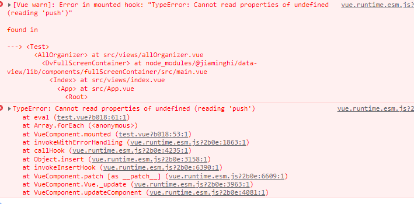

### 0001 js导致的中文编码乱码问题

utf-8格式需要如此添加<script charset="UTF-8"><script/>，gbk则不需要

### 0002 js中<text>字体颜色设置

标签中字体的颜色用fill来设置

### 0003 js中的扩展运算符[...]

```scala
// 1、在解构赋值中使用
let [a,b]=[1,2]
console.log(a,b) // a=1 b=2

let [c,d]=[1,2,3,4]
console.log(c,d) // 按需解构c=1 d=2

let [e,...f]=[1,2,3,4,5,6]
console.log(e,f) //e=1 f=[ 2, 3, 4, 5, 6 ]
    
// 2、用作剩余形参,就不必使用函数内置的argument伪数组  
function getMax(...item: number[]) : number{
  let max=item[0]
  for(let i=1;i<item.length;i++){
    if(max<item[i]){
      max=item[i]
    }
  }
  return max
}
console.log(getMax(2,3,4,78,23,56)) //78

// 3、将数组/string/对象在语法层面上展开
let number = [5,6,7,8,9]
console.log(...number) //5 6 7 8 9

let str = 'Hello World'
console.log(...str)  //H e l l o   W o r l d

let wc= {
  name:'晴天',
  age: 18
}
console.log({...wc}) //{ name: '晴天', age: 18 }

```

### 0004 js中的数据结构转换实例

```js
const temp1 = [{
      member_id1:'001',
      member_id2:'002',
      member_relatedNum: 5
    },
      {
        member_id1:'001',
        member_id2:'003',
        member_relatedNum: 3
      },
      {
        member_id1:'001',
        member_id2:'004',
        member_relatedNum: 2
      },
      {
        member_id1:'002',
        member_id2:'004',
        member_relatedNum: 2
      },
      {
        member_id1:'003',
        member_id2:'004',
        member_relatedNum: 2
      }]

    console.log(temp1)
    const map = {}


    /*temp1.forEach((item)=>{
      const id1 = item.member_id1;
      const id2 = item.member_id2;
      const relate = item.member_relatedNum;
      if(!map[id1]){
        map[id1]={member_id1:id1}
      }
      map[id1].member_relatedNum.push({
        member_id2:id2,
        member_relatedNum:relate
      })
    })*/

    temp1.forEach((item)=>{
      const id1 = item.member_id1;
      const id2 = item.member_id2;
      const relate = item.member_relatedNum;
      if(!map[id1]){
        map[id1]={member_id1:id1}
        map[id1].relatedMember = []
      }
      map[id1].relatedMember.push({
        member_id2:id2,
        member_relatedNum:relate
      })
    })
    console.log(map)
```



出现push undefined可能是因为没有初始化数组，导致缺少push属性，初始化=[ ]即可
