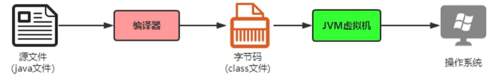
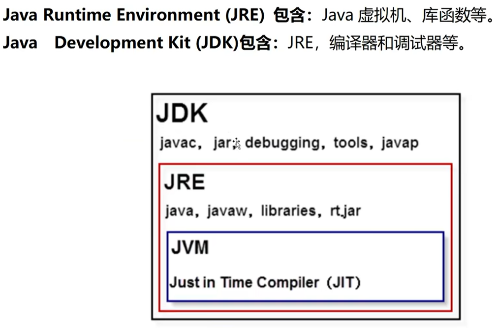

### 0001 List映射实例

```java
List<String> meetingEvaluations = this.findEvaluationById(meetingId).stream().map(meetingEvaluation -> {
    return meetingEvaluation.getMeeting_eva(); }).collect(Collectors.toList());
```

### 0002 判断文件是否存在

```java
File file = new File("d:\\hello.txt");
if (!file.exists()) {
    try {
        file.createNewFile();
    } catch (IOException e) {
        e.printStackTrace();
    }
    System.out.println("文件已创建");
} else {
    System.out.println("文件已存在");
}
```

### 0003 字符串中包含变量

```java
String.format("./pyUse/emotion.py %s", meetingId)
```

### 0004 字符串正则是否匹配

```java
String passwd = "rqbkjhrjqh1111@!45";
String regex = "^[A-Za-z]|[0-9]|[!@#$%^&*]{6,18}$";
if(!passwd .matches(regex)){
    return false; //验证不通过
}
```

### 0005  字符串首尾去空格

```java
str.trim()
```

### 0006 字符串转时间

```java
// long型字符串转yyyy-MM-dd HH:mm:ss格式
public static String longStrFormate(String time) {    
    Date date=new Date(Long.parseLong(time));
    SimpleDateFormat formatter=new SimpleDateFormat("yyyy-MM-dd HH:mm:ss");
    time=formatter.format(date);
    return time;
}
// String 转 Date
public static Date str2Date(String time) throws Exception{
    Date date=null;
    SimpleDateFormat formatter=new SimpleDateFormat("yyyy-MM-dd HH:mm:ss");
    date=formatter.parse(time);
    return date;
}

// 需要定义一个Date对象
// 定义一个简单时间格式SimpleDateFormat，时间类型是制造方法参数
// 使用格式对象将String的内容按照格式标准化之后得到的时间传给Date
```

### 0007 时间比较

```java
// 1
date1.compareTo(date2);
//如果两个日期相等，则返回值为0。
//如果date1在date2参数之后，则返回值大于0。
//如果date1在date2参数之前，则返回值小于0。


// 2
Date.before()，Date.after()和Date.equals()
if (date1.after(date2)) {
	System.out.println("Date1 时间在 Date2 之后");
}

if (date1.before(date2)) {
	System.out.println("Date1 时间在 Date2 之前");
}

if (date1.equals(date2)) {
	System.out.println("Date1 时间与 Date2 相等");
}


```

### 0008 线程和进程的区别

1. **定义**:
   - **进程**：是操作系统分配资源（如CPU时间、内存等）的基本单位。一个进程通常包含一个或多个线程，拥有独立的地址空间、文件描述符、栈以及其他记录其运行轨迹的辅助数据。
   - **线程**：是进程中的实际执行单位，是操作系统能够进行运算调度的最小单位。它被包含在进程中，是进程中的实际执行者。线程共享其所属进程的地址空间和资源，但每个线程有自己的执行栈和程序计数器（PC）。
2. **资源分配和共享**:
   - **进程**：拥有完全独立的地址空间，进程间通信（IPC）需要特定的机制，如管道、信号、套接字等。
   - **线程**：线程之间共享进程的资源（如内存、文件描述符等），因此线程间的通信和数据共享更加容易，但这也可能导致同步和数据一致性的问题。
3. **开销**:
   - **进程**：创建和销毁进程的开销相对较大，因为这涉及到操作系统分配和回收资源的过程。
   - **线程**：相比之下，线程的创建和销毁开销较小，因为它们共享所属进程的资源。线程的切换也比进程切换要快，因为线程共享的数据更多，上下文切换的成本较低。
4. **执行和调度**:
   - **进程**：拥有独立的执行流，操作系统独立调度每个进程。
   - **线程**：同一个进程内的线程共享执行流，操作系统调度时会考虑到线程的优先级和状态。
5. **影响和风险**:
   - **进程**：一个进程崩溃通常不会影响到其他进程，因为进程之间相互隔离。
   - **线程**：一个线程崩溃可能会影响到同一进程中的其他线程，因为它们共享相同的资源和地址空间。

### 0009 线程池核心参数

```java
ThreadPoolExecutor threadPoolExecutor = new ThreadPoolExecutor(//new完池里还没有线程
	int corePoolSize: 8,		// 核心线程数
    int maximumPoolSize: 16,	 // 最大线程数
    long keepAliveTime:
)


// 初始化一个核心线程
threadPoolExecutor.prestartCoreThread();
// 初始化全部核心线程
threadPoolExecutor.prestartAllCoreThread();
// ti'jiao

// 1. 创建固定大小的线程池 newFixedThreadPool
//1.创建一个大小为5的线程池
ExecutorService threadPool = Executors.newFixedThreadPool(5);
//2.使用线程池执行任务一
for (int i=0;i<5;i++){
    //给线程池添加任务
    threadPool.submit(new Runnable() {
        @Override
        public void run() {
            System.out.println("线程名"+Thread.currentThread().getName()+"在执行任务1");
        }
    });
}

// 2.newCachedThreadPool：带缓存的线程池，适用于短时间有大量任务的场景，但有可能会占用更多的资源；线程数量随任务量而定。
ExecutorService service= Executors.newCachedThreadPool();
//有50个任务
for(int i=0;i<50;i++){
    int finalI = i;
    service.submit(()->{
        System.out.println(finalI +"线程名"+Thread.currentThread().getName());//线程名有多少个，CPU就创建了多少个线程
    });
}

// 3.newSingleThreadExecuto:创建单个线程的线程池
ExecutorService service= Executors.newSingleThreadExecutor();
for (int i=0;i<5;i++){
    int finalI = i;
    service.submit(()->{
        System.out.println(finalI +"线程名"+Thread.currentThread().getName());//CPU只创建了1个线程，名称始终一样
    });
}


```

### 0010  java运行机制





### 0011 命名规则

1. 必须以字母、下划线、$开头
2. 其他部分是字母、_和$和数字的任意组合
3. 大小写敏感
4. 不能是Java的关键字

类名大驼峰、变量和方法小驼峰

### 0012 变量的本质

开辟一个空间，变量类型决定空间大小，通过变量名访问空间，变量值则是空间里存储的内容

### 0013 常用转义字符

```java
\n 换行	\t 制表符	\r 回车	\'	\"	\?	\0 空字符  \\	\b 退格
```

### 0014 位运算

```java
<<n //左移相当于*2的n次方
>>n //右移相当于/2的n次方
```

