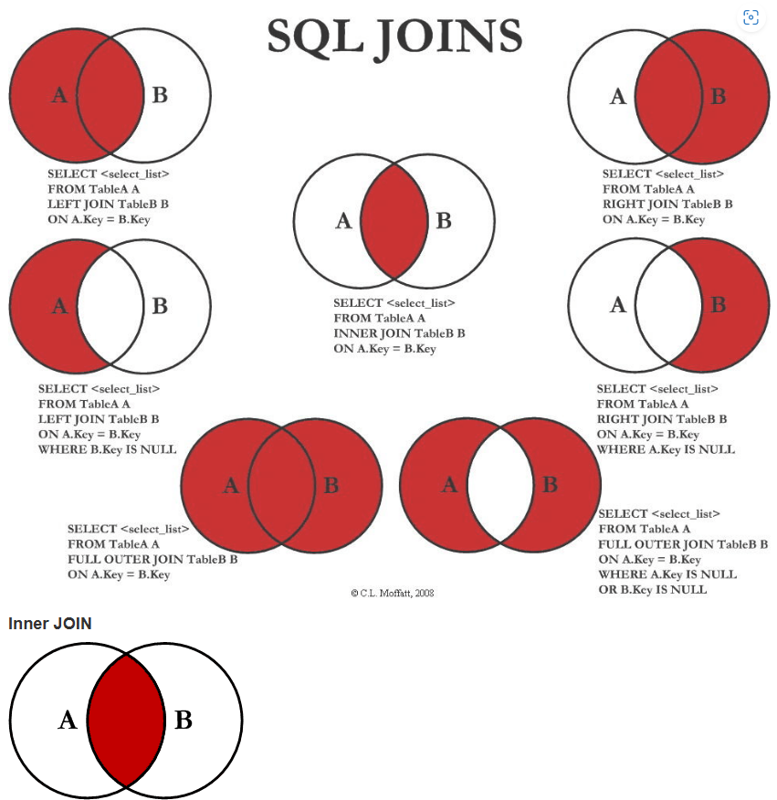

### 0001 更新某一个字段的数据

```sql
update 表名 set 字段名 = 更新内容s （将该字段的所有内容更新为相同的s）

update 表名 set 字段名 = 更新内容 where 限定条件 （在限定位置更新字段内容）
```

### 0002 将查询结果作为搜寻条件

```sql
SELECT
SUM(CASE WHEN meeting_hotelNum BETWEEN 0 AND 3 THEN 1 ELSE 0 END) AS '2017' FROM meeting_base WHERE meeting_base.organizer_id IN (SELECT organizer_id FROM meeting_organizer WHERE organizer_name="***")

SELECT
SUM(CASE WHEN meeting_hotelNum BETWEEN 0 AND 3 THEN 1 ELSE 0 END) AS '2017' FROM meeting_base WHERE meeting_base.organizer_id = (SELECT organizer_id FROM meeting_organizer WHERE organizer_name="***")

```

### 0003 去重查询

```sql
select distinct * from table

select c_name,c_year,c_month from table group by c_name,c_year,c_month
```

详情见：https://blog.csdn.net/wang1qqqq/article/details/115241993?ops_request_misc=%257B%2522request%255Fid%2522%253A%2522165251372616780366533395%2522%252C%2522scm%2522%253A%252220140713.130102334..%2522%257D&request_id=165251372616780366533395&biz_id=0&utm_medium=distribute.pc_search_result.none-task-blog-2~all~top_positive~default-1-115241993-null-null.142^v9^control,157^v4^new_style&utm_term=mysql%E6%9F%A5%E8%AF%A2%E5%8E%BB%E9%87%8D&spm=1018.2226.3001.4187

### 0004 查询结果生成新表

```sql
CREATE TABLE school SELECT * FROM class

CREATE TABLE school SELECT * FROME CLASS1,CLASS2 WHERE CLASS1.NAME=CLASS2.NAME

```

### 0005 插入条件判断

```sql
# 使用 INSERT INTO IF EXISTS
INSERT INTO a (order_id, operator, oper_date, memo) 
SELECT '3', 'onion3', '2017-11-28', '测试3'  
from DUAL  
where not exists(select order_id from a where operator='onion3' and memo = '测试3'); 

# 不存在插入，存在更新
INSERT INTO tb_addrbook(num,name,mobile) VALUE('1001','小李','13112345678') ON DUPLICATE KEY UPDATE name= '小李',mobile='13112345678'

# REPLACE INTO 以主键判别
REPLACE INTO 表名称(列1, 列2, 列3) VALUES(值1, 值2, 值3)
```

### 0006 排序

```sql
ORDER BY m1.member_id1 			# 默认为顺序
ORDER BY m1.member_id1 DESC 	# DESC 为逆序
```

### 0007 分组排序取前TOPN

```sql
SELECT 
member_id1,member_id2,member_relatedNum
FROM `member_relationship` m1
WHERE
10>(
SELECT COUNT(*) FROM `member_relationship` m2
WHERE m2.member_id1 = m1.member_id1 
AND m1.member_relatedNum  <=  m2.member_relatedNum
)
ORDER BY m1.member_id1, m1.member_relatedNum DESC 

# 02 窗口函数 MYSQL需要使用8以上的版本
select * 
from 
(select 
    member_id1,member_id2,member_relatedNum,
    row_number() over(
        partition by member_id1					# partition by 接分组字段
        order by member_relatedNum desc) num	 # order by 接排序字段
 	from member_relationship) as mr
where num <=10	
```

详情见：https://blog.csdn.net/qq_41934680/article/details/120816081

### 0008 SQL 在有5.7的版本下，安装8

详情见：http://t.csdn.cn/yt05W

### 0009 SQL 常用关键字顺序

```sql
select
from
where
group by
order by
```

```java
{
    member_id1:'001'
    member_id2:'002'
    member_relatedNum:1
},
{
    member_id1:'001'
    member_id2:'003'
    member_relatedNum:2
},{...}...
    
    
{
    member_id1:'001',
    relatedMember:[{
        member_id2:'002'
        member_relatedNum:1
    },
    {
        member_id2:'003'
        member_relatedNum:2
    }...]
}    
    
    
    
```

```js
const map = {}
temp1.forEach((item,i)=>{
    const id1 = item.member_id1; 
    const id2 = item.member_id2;
    const relate = item.member_relatedNum; 
    if(!map[id1]){
        map[id1]={member_id1:id1}
    }
    map[id1].member_relatedNum.push({
        member_id2:id2,
        member_relatedNum:relate
    })
})
```

### 0010 时间段

```sql
select * from booking where month(booking_time) =  month(curdate()) and year(booking_time) = year(curdate())  # month

select * from spf_booking where month(booking_time) =  month(curdate()) and week(booking_time) = week(curdate())  #week

SELECT *  
 
FROM blog_article  
 
WHERE year( FROM_UNIXTIME( BlogCreateTime ) ) = year( curdate( ))# year


# 按照年统计次数
select 
	me.member_id ,
    SUM(CASE WHEN year(mb.meeting_hostTime)=year(now()) THEN 1 ELSE 0 END) AS y1,
    SUM(CASE WHEN year(mb.meeting_hostTime)=year(date_sub(now(),interval 1 year)) THEN 1 ELSE 0 END) AS y2,
    SUM(CASE WHEN year(mb.meeting_hostTime)=year(date_sub(now(),interval 2 year)) THEN 1 ELSE 0 END) AS y3,
    SUM(CASE WHEN year(mb.meeting_hostTime)=year(date_sub(now(),interval 3 year)) THEN 1 ELSE 0 END) AS y4,
    SUM(CASE WHEN year(mb.meeting_hostTime)=year(date_sub(now(),interval 4 year)) THEN 1 ELSE 0 END) AS y5
from meeting_base mb, meeting_evaluation me 
where mb.meeting_index = me.meeting_index 
group by me.member_id 
```

详见：http://t.csdn.cn/Uz0bX

### 0011 左连接left join

```sql
# 是以左表为基础，根据ON后给出的两表的条件将两表连接起来。结果会将左表所有的查询信息列出，而右表只列出ON后条件与左表满足的部分。左连接全称为左外连接，是外连接的一种。
select * from A left join b on A
```

### 0012  创建时间字段

字段 create_time  默认值可以设置为CURRENT_TIMESTAMP

update_time 默认值可以设置为CURRENT_TIMESTAMP ON UPDATE CURRENT_TIMESTAMP

### 0013 MySQL5.x 自定义实现row_number() over(partition by ) 分组排序功能

```sql
select id,class,score,rank from (
	select 
		b.*,
		@rownum := @rownum+1 ,
    -- 定义用户变量@rownum来记录数据的行号。通过赋值语句@rownum := @rownum+1来累加达到递增行号。
		if(@pdept=b.class,@rank:=@rank+1,@rank:=1) as rank,
    -- 如果当前分组编号和上一次分组编号相同，则@rank（对每一组的数据进行编号）值加1，否则表示为新的分组，从1开始
		@pdept:=b.class 
    -- 定义变量@pdept用来保存上一次的分组id
	from (select * from a order by a.class,a.score desc) b ,
    -- 这里的排序不确定是否需要，保险点还是加上吧
		(select @rownum :=0 , @pdept := null ,@rank:=0) c  
    -- 初始化自定义变量值
	order by b.class,b.score desc -- 该排序必须，否则结果会不对
) result
having rank < 2;

```

### 0014 删除操作

```sql
drop #删除整张表
truncate #清空表内容
delete #删除单行数据不释放空间
delete from tableName where ()
```

### 0015 将查询结果插入新表

```sql
INSERT INTO 表名1(字段列表1) SELECT 字段列表2 FROM 表名2 WHERE 查询条件;
```

### 0016 查询为空时赋值为 ***

```sql
select ifnull(字段名,***) from 表名
```

### 0017 limit和offset的搭配使用

```sql
limit m,n # 取第m+1到m+n行的数据
offset n  # 去掉n个值，即跳过n个数据取第n+1个数据
# limit 和 offset的参数都不能参与计算，否则会报错
```

### 0018 [四大排名函数](https://www.cnblogs.com/52xf/p/4209211.html)

```sql
-- ROW_NUMBER
-- 为查询出来的每一行记录生成一个序号，依次排序且不会重复，注意使用row_number函数时必须要用over子句选择对某一列进行排序才能生成序号
select ROW_NUMBER() OVER(order by [SubTime] desc) as row_num,* from [Order]
-- RANK 
-- rank函数用于返回结果集的分区内每行的排名， 行的排名是相关行之前的排名数加一。简单来说rank函数就是对查询出来的记录进行排名，与row_number函数不同的是，rank函数考虑到了over子句中排序字段值相同的情况，如果使用rank函数来生成序号，over子句中排序字段值相同的序号是一样的，后面字段值不相同的序号将跳过相同的排名号排下一个，也就是相关行之前的排名数加一，可以理解为根据当前的记录数生成序号，后面的记录依此类推。
select RANK() OVER(order by [UserId]) as rank,* from [Order] 
-- DENSE_RANK
-- RANK 的序号可以不是连续的，DENSE_RANK是连续的
select DENSE_RANK() OVER(order by [UserId]) as den_rank,* from [Order]
-- NTILE 
-- ntile函数可以对序号进行分组处理，将有序分区中的行分发到指定数目的组中。 各个组有编号，编号从一开始。 对于每一个行，ntile 将返回此行所属的组的编号。这就相当于将查询出来的记录集放到指定长度的数组中，每一个数组元素存放一定数量的记录。ntile函数为每条记录生成的序号就是这条记录所有的数组元素的索引（从1开始）。也可以将每一个分配记录的数组元素称为“桶”。ntile函数有一个参数，用来指定桶数。下面的SQL语句使用ntile函数对Order表进行了装桶处理：
select NTILE(4) OVER(order by [SubTime] desc) as ntile,* from [Order]
```

### 0019 lag()和lead()

```sql
-- 用于数据表中访问前面行数据，用于在需要对前面行和当前行数据的对比
lag(字段，参数1，参数2) -- 字段就是数据库的字段，参数1就是要访问前面第几行，默认是1，可以忽略，参数2是如果在最前面了，默认值要写什么，可以忽略，格式可以简写lag(字段)
lag(字段，参数，参数) over(partition by 字段 order by 字段)

lead() -- 用法一致，为访问后面数据
```

### 0020 SQL 实现日期（时间加减）

```sql
select date(date(),'-1 days') as 昨天, date() as 今天, date(date(),'+1 days') as 明天;
datediff(day,endtime,starttime) -- 第一个参数表示你要的是天数还是其他日期，这个表示两个日期之间的天数，注意是endtime-starttime。
date_sub(时间,interval * day/month/year) -- 减去*的时间
date_add(时间,interval * day/month/year) -- 增加*的时间
```

### 0021 统计某字段重复出现的值

```sql
select  A,count(A) from  表名 where 条件  group by A  having(count(A))>1
-- A列 ，A列某一个值重复的数量
-- 思路：先通过A分组，然后统计数量
```

### 0022 cast()

```sql
-- 做数据类型转换，默认转换为长度30
SELECT CAST('12' AS int) 
-- CAST()函数和CONVERT()函数都不能执行四舍五入或截断操作。由于12.5不能用int数据类型来表示，所以对这个函数调用将产生一个错误，所以如果'12.5',类型就不能是int
```

### 0023 [SQL 计算占比](https://huaweicloud.csdn.net/63355d96d3efff3090b54452.html?spm=1001.2101.3001.6650.2&utm_medium=distribute.pc_relevant.none-task-blog-2~default~CTRLIST~activity-2-123530514-blog-122983734.235^v35^pc_relevant_increate_t0_download_v2_base&depth_1-utm_source=distribute.pc_relevant.none-task-blog-2~default~CTRLIST~activity-2-123530514-blog-122983734.235^v35^pc_relevant_increate_t0_download_v2_base&utm_relevant_index=5)

如果是某个字段值出现的比例可以使用 avg("***" = "***")

### 0024 union 和union all

**union** 会自动压缩多个结果集合中的重复结果，而 **union all** 则将所有的结果全部显示出来，不管是不是重复。

### 0025 sql分奇偶

可以使用 x%2 判断,  也可以 x&1判断, 还可以使用mod(x,2)

### 0026 not in 返回错误

not in 比较的字段里如果存在null，则所有的比较信息都会返回false

### 0027 各种join



### 0028 count(表达式)

```sql
count (表达式 or null)
-- count在值是NULL是不统计数， （count(‘任意内容’)都会统计出所有记录数，因为count只有在遇见null时不计数，即count(null)==0，因此前者单引号内不管输入什么值都会统计出所有记录数），至于加上or NULL ， 很像其他编程里的or运算符，第一个表达式是true就是不执行or后面的表达式，第一个表达式是false 执行or后面的表达式 ，Count才不会统计上这条记录数
```

### 0029 like用法

- %任意个字符
- _任意单个字符

### 0030 nvl函数

```sql
-- comm为需要判断是否为空的列名 NVL函数的功能是实现空值的转换，根据第一个表达式的值是否为空值来返回相应的列名或表达式，主要用于对数据列上的空值进行处理，语法格式如：NVL( string1, replace_with)。
数字型： NVL(comm,0);
 
字符型： NVL( TO_CHAR(comm), 'No Commission')
 
日期型： NVL（hiredate,' 31-DEC-99')
```

### 0031 核查两个表中不匹配的部分

可以使用left join对字段依次on,看哪里出现null

```sql
select a.* from
(select * from bass.DM_GRP_CD_FIGURE_FLAG_DM where stat_date='20230611' and is_qdk_flag='1') a
left outer join
(select * from dcstore.DM_GOMP_GRID_ENT_DM   where stat_date='20230611' and  md_list_flag='1' and grp_lvl in('C','D') ) b
on a.boss_grp_id=b.grp_id
where b.grp_id is null
```

### 0032 group_concat

将group by产生的同一个分组中的值连接起来，返回一个字符串结果。

```sql
group_concat([distinct] 字段名 [order by 排序字段 asc/desc] [separator '分隔符'])
# 例
group_concat(distinct product order by product separator ',')	
```

### 0033 限定时间段的写法

```sql
# 以2020-02为例
(1) order_date between '2020-02-01' and '2020-02-29'  
(2) order_date like '2020-02%'  
(3) DATE_FORMAT(order_date, "%Y-%m") = "2020-02"   
(4) LEFT(order_date, 7) 或 substr(1, 7) = "2020-02" 
```

### 0034 行列转换

行转列用groupby+sumif，列转行用union all

```sql
# 例：leetcode 1795
select product_id,'store1' store, store1 price from Products where store1 is not null
union all
select product_id,'store2', store2 from Products where store2 is not null
union all
select product_id,'store3', store3 from Products where store3 is not null


select product_id, sum(if(store = 'store1')) store1,
                 , sum(if(store = 'store2')) store2,
                 , sum(if(store = 'store3')) store3
from Products
group by product_id
```

