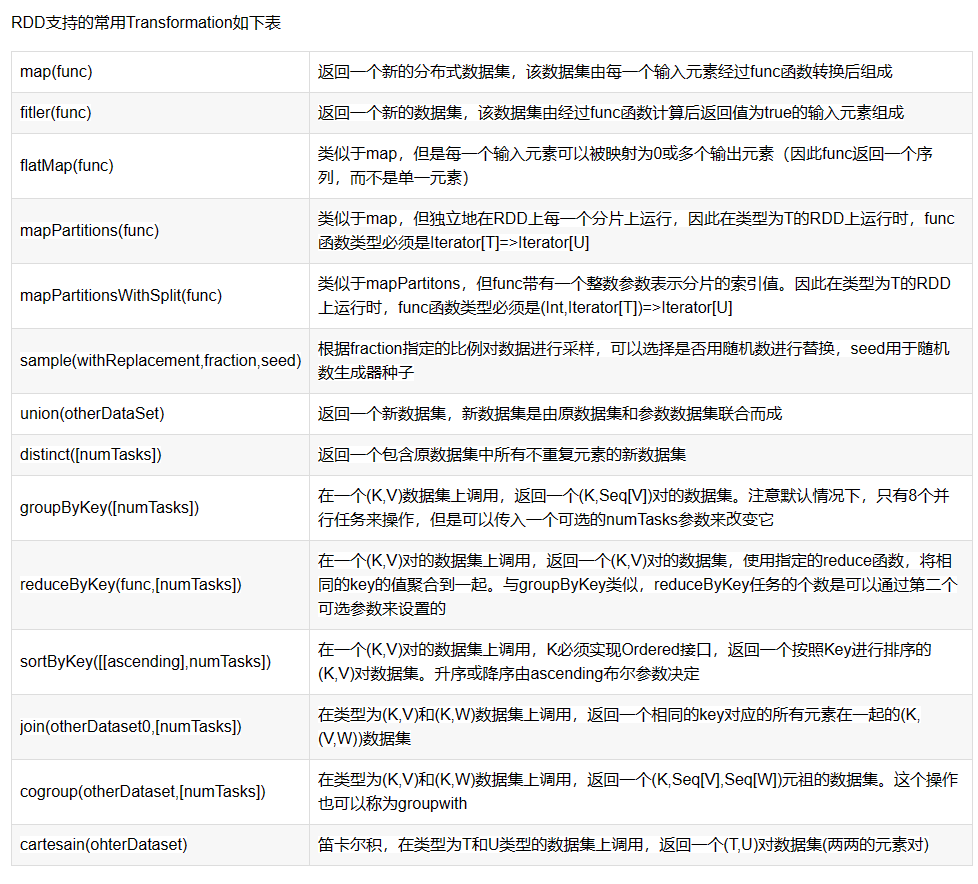
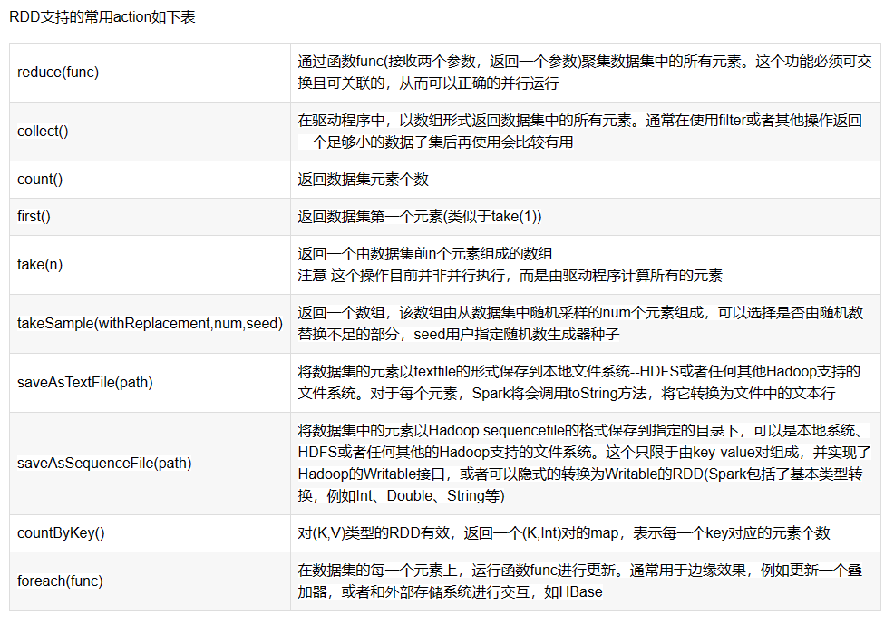
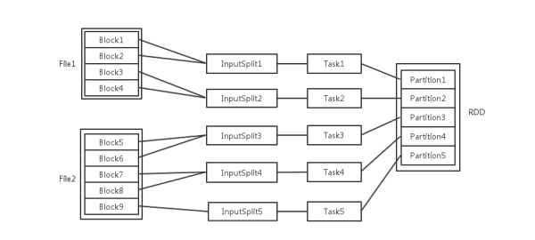
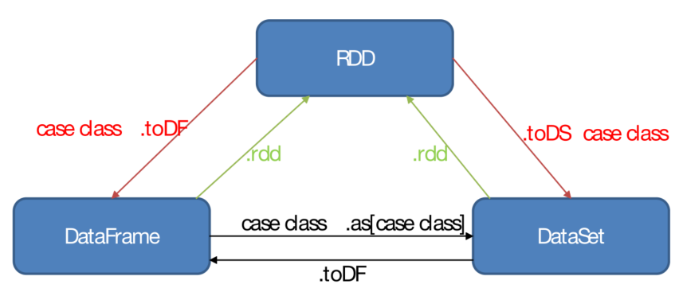
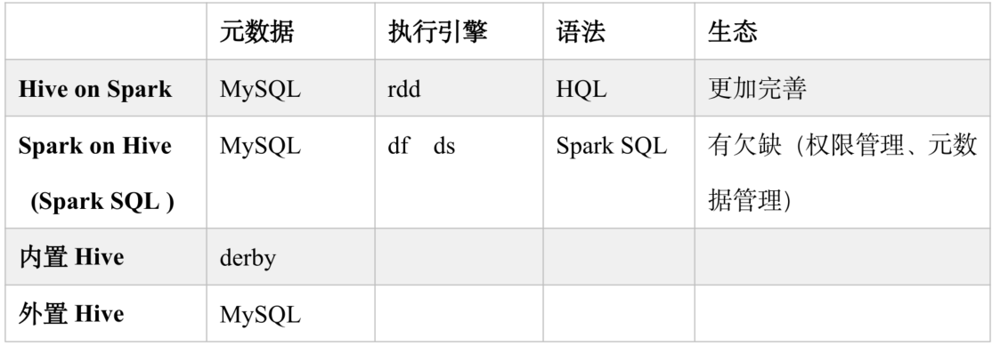

### 0001 On Yarn模式下一直提示输出路径已存在，删除也没用

调试发现本地scala版本问题，版本全部统一为2.12解决

### 0002 rdd操作模式

RDD创建后就可以在RDD上进行数据处理。RDD支持两种操作：转换（transformation），即从现有的数据集创建一个新的数据集；动作（action），即在数据集上进行计算后，返回一个值给Driver程序。

 RDD 的转化操作是返回一个新的 RDD 的操作，比如 map() 和 filter() ，而行动操作则是向驱动器程序返回结果或把结果写入外部系统的操作，会触发实际的计算，比如 count() 和 first() 。Spark 对待转化操作和行动操作的方式很不一样，因此理解你正在进行的操作的类型是很重要的。如果对于一个特定的函数是属于转化操作还是行动操作感到困惑，你可以看看它的返回值类型：转化操作返回的是 RDD，而行动操作返回的是其他的数据类型。

 RDD中所有的Transformation都是惰性的，也就是说，它们并不会直接计算结果。相反的它们只是记住了这些应用到基础数据集（例如一个文件）上的转换动作。只有当发生一个要求返回结果给Driver的Action时，这些Transformation才会真正运行。

这个设计让Spark更加有效的运行。

 



### 0003 spark  Task，Executor，Core配置调优

分区（Partition）数
我们都知道一个 RDD 中有多个 Partition，Partition 是 Spark RDD 计算的最小单元，决定了计算的并发度。
分区数如果远小于集群可用的 CPU 数，不利于发挥 Spark 的性能，还容易导致数据倾斜等问题。
分区数如果远大于集群可用的 CPU 数，会导致资源分配的时间过长，从而影响性能。
那么，Partition 的数量是由什么决定的呢？


这个又得根据 RDD 的创建方式分为两种情况：

1、从内存中创建 RDD：sc.parallelize(...)，那么默认的分区数量为该程序所分配的资源的 CPU 数量。
2、从 HDFS 文件创建：sc.textFile(...) 或 spark.sql(...)，每个 HDFS 文件以块（Block）的形式存储，Spark 读取时会根据具体数据格式对应的 InputFormat 进行解析，例如文本格式就用 TextInputFormat 进行解析，一般是将若干个 Block 合并为一个输入分片（InputSplit），而这个 InputSplit 数就是默认的分区数。
然而，RDD 经过不同的算子计算后，分区数目又会变化。

通过 Generic Transformation 创建
filter(), map(), flatMap(), distinct() Partition 数量等于父 RDD 的数量。
rdd.union(other_rdd) Partition 数量等于 rdd_size + other_rdd_size
rdd.intersection(other_rdd) Partition 数量等于 max(rdd_size, other_rdd_size)
rdd.subtract(other_rdd) Partition 数量等 于rdd_size
rdd.cartesian(other_rdd) Partition 数量等于 rdd_size * other_rdd_size
通过 Key-based Transformation 创建
什么是 key-based？key-based 指的是执行 transformation 的 rd d都必须是 pair rdd，在 pyspark 中，并没有 pair rdd 这个类型，一个 rdd 要成为有效的 pair rdd，只需要 rdd 中的每条记录满足 k, v = kv，也就是只要是一个支持迭代，且一共含有两个元素的对象即可，可以是(k, v) ，也可以是[k, v]， 也可以是自定义类型等。
在默认的情况下：
reduceByKey(), foldByKey(), combineByKey(), groupByKey() partition 数量等于 parent rdd 的数量，使用 HashPartitioner，允许自己指定 hash 函数
sortByKey() partition 数量等于 parent rdd 的数量，使用 RangePartitioner
mapValues(), flatMapValues() partition 数量等于 parent rdd 的数量，使用 parent rdd 的 partitioner，这两个函数接收的 parent rdd 必须为 pair rdd， 确保执行完以后保持原有 partition 不变
join(), leftOuterJoin(), rightOuterJoin() partition 数量取决于相关的两个 rdd， 使用 HashPartitioner
Task 数
总的 Task 数
默认情况下，Task 的数量是由 Partition 决定的，RDD 计算时，每个分区会启一个 Task，所以 RDD 的分区数决定了总 Task 数。

在类 DAGScheduler 中的 submitMissingTasks 方法中，在 Stage 中会根据 RDD 的 Partitions 来获得一个 TaskSet，每个 Task 处理一个 Partition。

DAGSchedueler.scala:

Copy

```scala
// From submitMissingTasks
...   
val tasks: Seq[Task[_]] = try {
  stage match {
    case stage: ShuffleMapStage =>
      partitionsToCompute.map { id =>
        val locs = taskIdToLocations(id)
        val part = stage.rdd.partitions(id)
        new ShuffleMapTask(stage.id, stage.latestInfo.attemptId,
          taskBinary, part, locs, stage.latestInfo.taskMetrics, properties)
      }

    case stage: ResultStage =>
      val job = stage.activeJob.get
      partitionsToCompute.map { id =>
        val p: Int = stage.partitions(id)
        val part = stage.rdd.partitions(p)
        val locs = taskIdToLocations(id)
        new ResultTask(stage.id, stage.latestInfo.attemptId,
          taskBinary, part, locs, id, properties, stage.latestInfo.taskMetrics)
      }

  }
}
```


...

HDFS File Block、InputSplit、Partition 和 Task 数量的关系可见下图：



Task 的最大并发数
申请的计算节点（Executor）数目和每个计算节点核数，决定了你同一时刻可以并行执行的 Task 数目。
同时又因为只有当前的 Stage 计算完成，才能计算下一个 Stage，一个 Stage 会为 RDD 的每个 Parition 生成一个 Task 任务，所以 Task 的并发数目还受 RDD 的分区数影响。

当 Task 被 Executor 提交后，会根据 Executor 可用的 CPU 核数，来决定一个 Executor 总同时可以执行多少个 Task。

在类 TaskSchedulerImpl 的 resourceOfferSingleTaskSet 方法中，CPUS_PER_TASK 的定义为val CPUS_PER_TASK = conf.getInt("spark.task.cpus", 1)，也就是说默认情况下一个task对应cpu的一个核。如果一个executor可用cpu核数为8，那么一个executor中最多同是并发执行8个task；假如设置spark.task.cpus为2，那么同时就只能运行4个task。

TaskSchedulerImpl.scala:

Copy

```scala
// From resourceOfferSingleTaskSet
...
  if (availableCpus(i) >= CPUS_PER_TASK) {
    try {
      for (task <- taskSet.resourceOffer(execId, host, maxLocality)) {
        tasks(i) += task
        val tid = task.taskId
        taskIdToTaskSetManager(tid) = taskSet
        taskIdToExecutorId(tid) = execId
        executorIdToTaskCount(execId) += 1
        executorsByHost(host) += execId
        // 决定了一个 Executor 中可以运行多少个 Task
        availableCpus(i) -= CPUS_PER_TASK
        assert(availableCpus(i) >= 0)
        launchedTask = true
      }
    } catch {
      case e: TaskNotSerializableException =>
        logError(s"Resource offer failed, task set ${taskSet.name} was not serializable")
        // Do not offer resources for this task, but don't throw an error to allow other
        // task sets to be submitted.
        return launchedTask
    }
  }
...
```


Task 的调优
But！！！
通常根据默认情况下，Task 的数量是偏少的，如果 Task 数目偏少，就会导致前面设置好的 Executor 的参数都前功尽弃。

例如，Executor进程有很多个，CPU 和内存资源也相当充足，但是由于 RDD 的分区数较少，那么 Task 数也很少，那么很多 Executor 进程很可能根本就没有 Task 可以执行，导致并行执行的 Task 数太少，资源也就白白浪费了。

因此 Spark 官网建议的 Task 的设置原则是：设置 Task 数目为num-executors * executor-cores的2~3倍较为合适。例如 Executor 的总 CPU core 数量为300个，那么设置1000个 Task 是可以的，此时可以充分地利用 Spark 集群的资源。

Executor 数
num-executors = spark.cores.max / spark.executor.cores

spark.cores.max 是指你的 Spark 程序需要的总核数
spark.executor.cores 是指每个 Executor 需要的核数

而这些参数是在使用 spark-submit 提交程序时，根据作业和集群的情况手动设置的（具体需要设置多少，那样根据 Spark 的调优经验来定了），因为默认情况下，只会启动少量的 Executor，无法发挥 Spark 集群的性能。
例如：

```shell
$ bin/spark-submit \
--master yarn-cluster \
--num-executors 100 \
--executor-memory 6G \
--executor-cores 4 \
-- ...
```

```python
conf = SparkConf() \
    .setMaster("local[*]") \
    .setAppName("RFO") \
    .set("spark.driver.memory", "8g") \
	.set("spark.executor.num", "8g") \
    .set("spark.executor.memory", "8g") \
	.set("spark.executor.cores", "8") \
    .set("spark.executor.memoryOverhead", "512m") \
    .set("spark.driver.maxResultSize", "4g")
```

### 0004 rdd 五大属性

1. RDD有一系列的partition组成 ，标记数据是哪个分区

   protected def getPartitions:Array[Partition]

2. 函数作用在每一个partition（split）上

   def compute(split: Partition, context: TaskContext): Interator[T]

3. RDD之间有一系列的依赖关系

4. 分区器是作用在（K，V）上

5. RDD提供一系列最佳的计算位置，存储存取每个Partition的优先位置（preferred location）。移动数据不如移动计算，除非资源不够

   protected def getPreferredLocations(split : Partition) : scala.Seq[String]

   

### 0005 常用转换算子

单Value

1. map
2. mapPartitions
3. mapPartitionsWithIndex
4. flatMap
5. groupBy
6. filter
7. distinct
8. coalesce
9. repartition
10. sortBy

双Value

1. intersection
2. union
3. subtract
4. zip

key-value

1. partitionBy
2. reduceByKey        有预聚合
3. groupByKey          没有预聚合
4. sortByKey
5. mapValues
6. join

### 0006 血缘宽窄依赖

宽依赖： 有shuffle（有聚合操作）

窄依赖： 没有shuffle

### 0007 rdd df ds 三者之间的转换

 

### 0008 hive on spark 和spark on hive的区别



### 0009 执行过程

