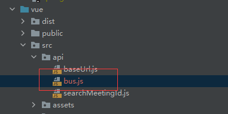
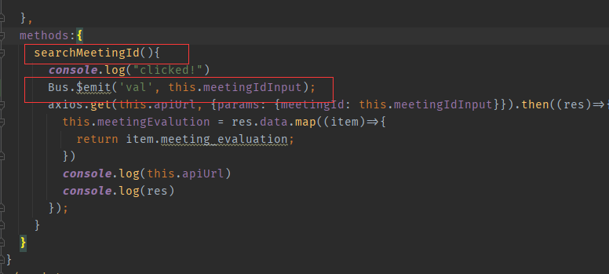
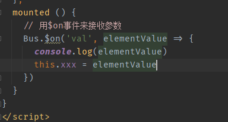

### 0001 组件之间互相传值问题

可以定义一个Bus.js 来进行传值



```js
//bus.js
import Vue from 'vue'
export default new Vue()
```




在事件中将值传到bus

```vue
将此处的值传出去
<template>
  <div>
    <el-row :gutter="3">
      <el-col :span="15">
        <div style="margin-left: 6px" class="grid-content bg-purple">
          <el-input v-model="meetingIdInput" placeholder="请输入内容"></el-input>
        </div>
      </el-col>
      <el-col :span="6">
        <div class="grid-content bg-purple">
          <el-button @click.native.prevent="searchMeetingId">选择会议</el-button>
        </div>
      </el-col>
    </el-row>
  </div>
</template>

<script>
import axios from "axios"
import Bus from '/src/api/bus.js'
export default {
  name: "upCenter",
  data() {
    return {
      apiUrl: 'http://127.0.0.1:8000/search/meetingId',
      meetingIdInput:'',
      meetingEvalution:[]
    }
  },
  mouted:{

  },
  methods:{
    searchMeetingId(){
      console.log("clicked!")
      Bus.$emit('val', this.meetingIdInput);
      axios.get(this.apiUrl, {params: {meetingId: this.meetingIdInput}}).then((res)=>{
        this.meetingEvalution = res.data.map((item)=>{
          return item.meeting_evaluation;
        })
        console.log(this.apiUrl)
        console.log(res)
      });
    }
  }
}
</script>

<style scoped>

</style>
```



```vue
<template>
  <div>value:{{xxx}}</div>
</template>

<script>

import Bus from '/src/api/bus.js'
export default {
  name: "upRight",
  data(){
    return{
      xxx:0
    }
  },
  mounted () {
    // 用$on事件来接收参数
    Bus.$on('val', elementValue => {
      console.log(elementValue)
      this.xxx = elementValue
    })
  }
}
</script>

<style scoped>


</style>
```

### 0002 父组件通过props向子组件传值

```vue
<!--父组件-->
<DownRight v-if="isRouterAlive" :meetingId="this.meetingIdInput"/>

<!--子组件-->

<template>
  <div >
    
  </div>
</template>

<script>

export default {
  name: "downRight",
  props:{
    meetingId: String
  },
  data(){
    return{
      imgUrl:'001'
    }
  },
  mounted () {


  },
  created(){
    this.imgUrl = this.meetingId;
  },
  watch:{
    inputId(val){
      this.imgUrl = val;
    }
  }

}
</script>

<style scoped>

</style>
```

### 0003 子组件向父组件传值

1. 子组件主动触发将数据传递给父组件

   1.1 在子组件上绑定触发事件this.$emit('getTreeData',this.$refs.treeData.getCheckedNodes());

   ```vue
   <template>
       <div>
           <Tree :data="treeData" show-checkbox ref="treeData"></Tree>
           <Button type="success" @click="submit"></Button>
       </div> 
   </template>
   
   <script>
   ...
   submit(){
        this.$emit('getTreeData',this.$refs.treeData.getCheckedNodes());
         },
    ...
   
   </script>
   ```

   1.2 在父组件中绑定触发事件<AuthTree/>为子组件

   ```vue
   <AuthTree  @getTreeData='testData'></AuthTree>
   
   <script>
   ...
   testData(data){
         console.log("parent");
         console.log(data)
       },
   
    ...
   
   </script>
   ```

2. 父组件调用子组件

   2.1子组件绑定def

   ```vue
   <template>
       <div>
       	<Tree :data="treeData" show-checkbox ref="treeData"></Tree>
       </div>
   </template>
   <script>
   ...
   getData(){
           return this.$refs.treeData.getCheckedNodes()
       },
    ...
   
   </script>
   ```

   2.2 父组件注册子组件后绑定ref

   ```vue
   <AuthTree ref="authTree"></AuthTree>
   <script>
   ...
   console.log( this.$refs.authTree.getData());
    ...
   
   </script>
   ```

### 0004 抛出信息

```js
this.$message.success('登录成功');
```

