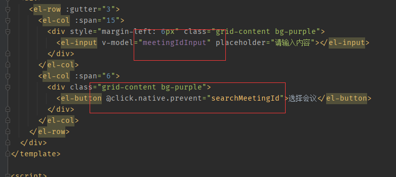

### 0001 组件之间互相传值问题

可以定义一个Bus.js 来进行传值


```js
//bus.js
import Vue from 'vue'
export default new Vue()
```




在事件中将值传到bus

```vue
将此处的值传出去
<template>
  <div>
    <el-row :gutter="3">
      <el-col :span="15">
        <div style="margin-left: 6px" class="grid-content bg-purple">
          <el-input v-model="meetingIdInput" placeholder="请输入内容"></el-input>
        </div>
      </el-col>
      <el-col :span="6">
        <div class="grid-content bg-purple">
          <el-button @click.native.prevent="searchMeetingId">选择会议</el-button>
        </div>
      </el-col>
    </el-row>
  </div>
</template>

<script>
import axios from "axios"
import Bus from '/src/api/bus.js'
export default {
  name: "upCenter",
  data() {
    return {
      apiUrl: 'http://127.0.0.1:8000/search/meetingId',
      meetingIdInput:'',
      meetingEvalution:[]
    }
  },
  mouted:{

  },
  methods:{
    searchMeetingId(){
      console.log("clicked!")
      Bus.$emit('val', this.meetingIdInput);
      axios.get(this.apiUrl, {params: {meetingId: this.meetingIdInput}}).then((res)=>{
        this.meetingEvalution = res.data.map((item)=>{
          return item.meeting_evaluation;
        })
        console.log(this.apiUrl)
        console.log(res)
      });
    }
  }
}
</script>

<style scoped>

</style>
```


```vue
<template>
  <div>value:{{xxx}}</div>
</template>

<script>

import Bus from '/src/api/bus.js'
export default {
  name: "upRight",
  data(){
    return{
      xxx:0
    }
  },
  mounted () {
    // 用$on事件来接收参数
    Bus.$on('val', elementValue => {
      console.log(elementValue)
      this.xxx = elementValue
    })
  }
}
</script>

<style scoped>


</style>
```

