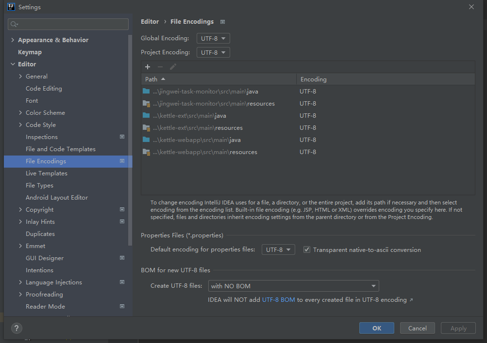
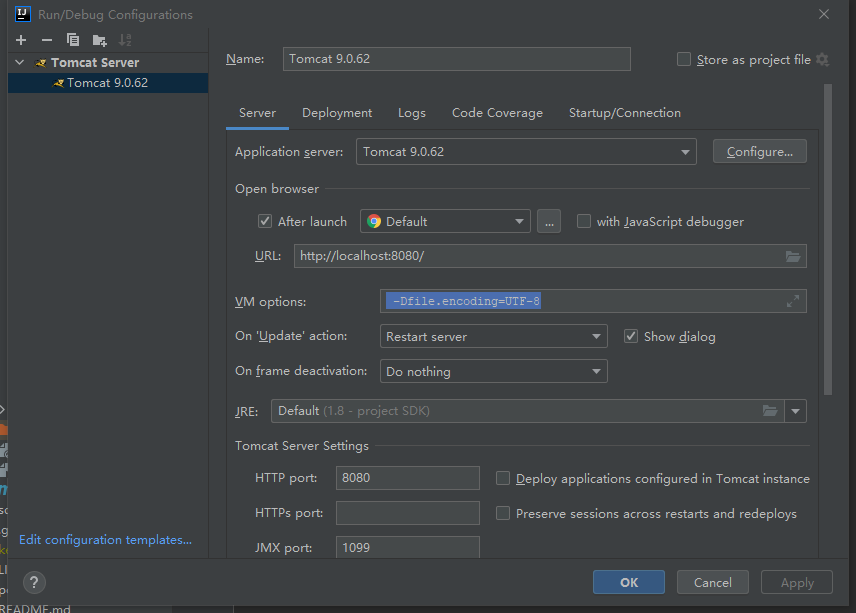
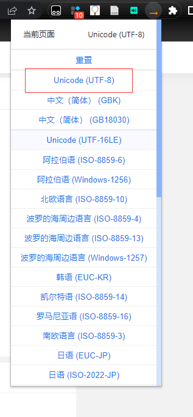
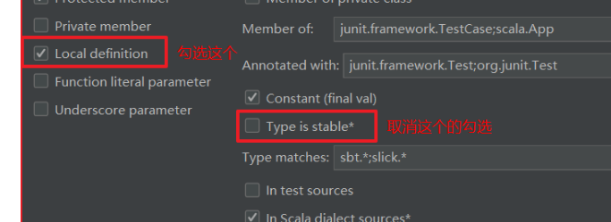

### 0001 spring ssm 运行jsp乱码 ，tomcat 乱码

需要统一中文编码格式，此处我使用的是UTF-8(idea 有的地方好像不能识别小写)

首先解决tomcat 乱码

找到安装路径下\conf\server.xml

```xml
<Connector port="8080" protocol="HTTP/1.1"
               connectionTimeout="20000"
               redirectPort="8443" URIEncoding="UTF-8"/>
```

logging.properties

```properties
java.util.logging.ConsoleHandler.level = FINE
java.util.logging.ConsoleHandler.formatter = org.apache.juli.OneLineFormatter
# java.util.logging.ConsoleHandler.encoding = UTF-8
# java.util.logging.ConsoleHandler.encoding = GBK
# 都注释掉，或者留下UTF-8
```

idea编码配置



jvm 配置

 -Dfile.encoding=UTF-8



在idea64.exe.vmoptions中

```properties
-Dfile.encoding=UTF-8
```

jsp 编码格式

```jsp
<!--在开头-->
<%@ page language="java" contentType="text/html; charset=utf-8" pageEncoding="utf-8"%>
<!--在head-->
<meta http-equiv="Content-Type" content="text/html; charset=utf-8" />
```

浏览器编码格式，谷歌下载charset插件



总结：这次出现的问题主要是tomcat版本太新了，各处的默认编码为GBK导致

其次，idea工程的默认编码为GBK

### 0002 常用快捷

"   ".var= CTRL+ALT+V   快速补全类和对象名

Alt + lnsert 快速生成构造函数

Ctrl + T  自动生成try/catch

Ctrl + Alt + B  查看类的源代码

Alt + Enter  修复

ctrl+shift+J  合并字符串为一行

ctrl+shift+N  查找类名、文件名、变量

### 0003 scala生成变量自动勾选specify type

