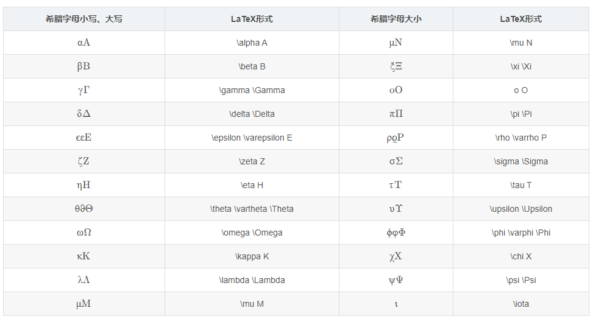

### 0001 cron表达式

{秒数} {分钟} {小时} {日期} {月份} {星期} {年份(可为空)}

字段 允许值 允许的特殊字符 
秒 0-59 , - * / 
分 0-59 , - * / 
小时 0-23 , - * / 
日期 1-31 , - * ? / L W C 
月份 1-12 或者 JAN-DEC , - * / 
星期 1-7 或者 SUN-SAT , - * ? / L C # 
年（可选） 留空, 1970-2099 , - * / 

\* 表示所有值； 
? 表示未说明的值，即不关心它为何值； 
\- 表示一个指定的范围； 
, 表示附加一个可能值； 
/ 符号前表示开始时间，符号后表示每次递增的值； 

*/5 * * * * ? 每隔5秒执行一次
 0 */1 * * * ? 每隔1分钟执行一次
 0 0 5-15 * * ? 每天5-15点整点触发
 0 0/3 * * * ? 每三分钟触发一次
 0 0-5 14 * * ? 在每天下午2点到下午2:05期间的每1分钟触发 
 0 0/5 14 * * ? 在每天下午2点到下午2:55期间的每5分钟触发
 0 0/5 14,18 * * ? 在每天下午2点到2:55期间和下午6点到6:55期间的每5分钟触发
 0 0/30 9-17 * * ? 朝九晚五工作时间内每半小时
 0 0 10,14,16 * * ? 每天上午10点，下午2点，4点 

在线cron表达式生成器

http://www.pdtools.net/tools/becron.jsp

http://cron.qqe2.com/

### 0002 latex 希腊字母对应表

```latex
$\alpha$ % 排版的时候出现公式和zhuan'h
```



### 0002 excel中使用数据透视

将数据贴到excel中选中，点击插入，可以根据推荐的数据透视表直接生成，用于数据分析十分方便

### 0003 excel中固定第一页

并没有这个功能，不过可以利用宏，在菜单栏中添加宏，跳转第一页

宏的创建方法alt+f11，新建

```
Sub x()
    ActiveWorkbook.Sheets("Sheet1").Activate
End Sub
```

然后右键菜单栏，自定义，添加宏

### 0004 excel 单元格换行

alt+enter