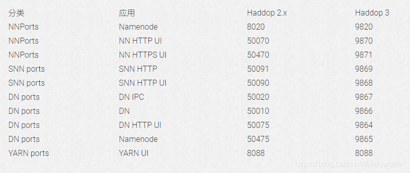

## hadoop

- hdfs：http://master:9870   (2.x是50070)
- yarn：http://master:8088
- MRHistory：http://master:19888



## spark

- job:    http://master:4040
- 集群：http://master:8080
- HIstoryServer:   http://master:18080

## Zoopkeeper

- 2181 ： 客户端连接zookeeper的端口
- 2888 ： zookeeper集群内通讯使用，Leader监听此端口
- 3888 ： zookeeper端口 用于选举leader

## HBase

- 16010：Apache的master的WEB UI端口
- 60010：[CDH](https://cloud.tencent.com/product/cdh?from=20065&from_column=20065)的master的WEB UI端口 
- 60030：CDH的regionServer的WEB UI 管理端口

## Hive

- 9083  :  metastore服务默认监听端口 
- 10000：Hive 的JDBC端口

## Kafka

- 9092： Kafka集群节点之间通信的RPC端口

## Flink

- 8081 ： WEB UI 端口(和spark同时使用会有冲突)
- **Spark集群后再启动Flink会发现8081端口被Spark占用了**
- **Kafka的zookeeper和Flink有冲突。**

```shell
vim flink-conf.yaml 
修改或添加（注意:后有一个空格，否则无法生效）：
rest.port: 8082
```

## Flume

```shell
#监听数据来源为本地的xxxx端口
a1.sources.r1.type = xxxx
a1.sources.r1.bind = ip
a1.sources.r1.port = xxxx
```

## Redis

- 6379： Redis服务端口

## CDH

- 7180： Cloudera Manager WebUI端口 
- 7182： Cloudera Manager Server 与 Agent 通讯端口

## HUE

- 8888： Hue WebUI 端口