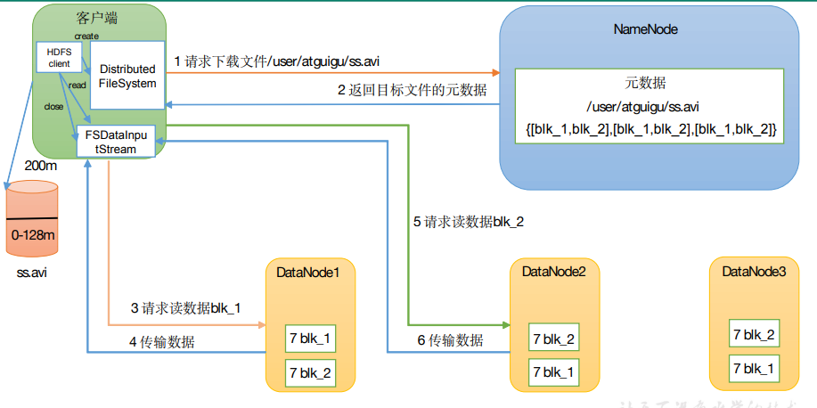
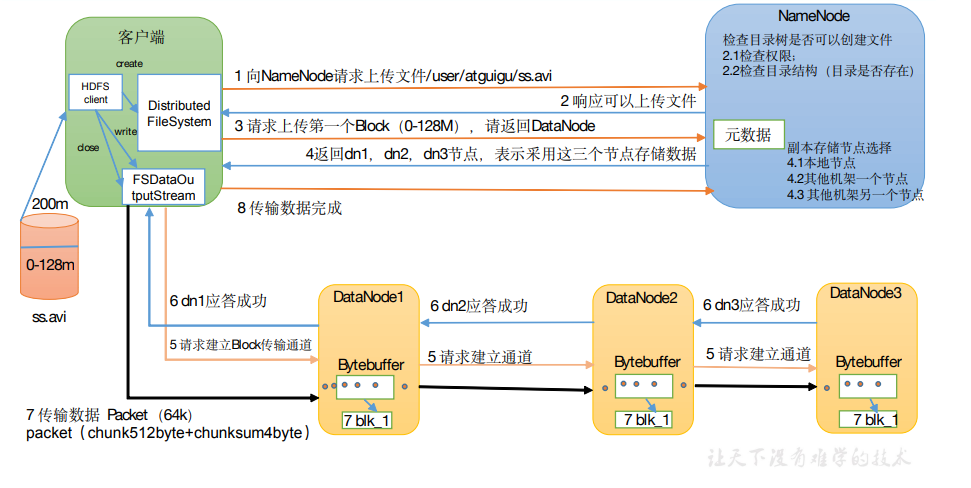

# 1、Hadoop

## 1.1 hdfs读写流程

### 1.1.1 读数据流程：

1. client客户端向namenode发送RPC请求，请求文件block的位置
2. namenode收到请求后检查权限和判定文件是否存在后，返回文件的元数据，包含block副本的datanode地址，根据拓扑结构对距离进行排序。
3. 选择排序最前的datanode请求读取block
4. 重复的调用FSDataInputStream的read方法，直到块上的数据读取完毕

注意：

- 每读完一个block都会进行checksum验证，如果读取DataNode时出现失误，客户端会通知NameNode，然后从下一个block副本中读取数据
- read方法时并行的读取block的信息，不是一块一块的读取
- NameNode只返回Client请求的数据块的地址，不返回数据

### 1.1.2 写数据流程：

1. Client向NameNode发送上传请求，通过RPC与NameNode建立通信
2. NameNode检测用户是否有上传权限，目录是否存在，通过后返回一个可以上传的信息
3. Client根据文件的大小进行切分，默认128M一份，切分完后向NameNode发送请求，请求一个上传的地址（第一个block）
4. NameNode返回可用DataNode地址，默认存放三份，分别为本地一份，同机架其他节点一份，不同机架节点一份
5. Client向第一个节点A进行通信，然后A收到请求后继续向B建立通道，B再向C建立通道，建立好整个pipeline，逐级返回Client
6. Client 开始向 A 上发送第一个 block（先从磁盘读取数据然后放到本地内存缓存），以 packet（数据包，64kb）为单位，A 收到一个 packet 就会发送给B，然后 B 发送给 C，A 每传完一个 packet 就会放入一个应答队列等待应答
7. 数据被分割成一个个的 packet 数据包在 pipeline 上依次传输，在 pipeline 反向传输中，逐个发送 ack（命令正确应答），最终由 pipeline 中第一个 DataNode 节点 A 将 pipelineack 发送给 Client；
8. 当一个 block 传输完成之后, Client 再次请求 NameNode 上传第二个 block， NameNode 重新选择三台 DataNode 给 Client

注意：如果DataNode突然挂掉，当客户端不能受到ack确认时，会通知NameNode，NameNode检查并确认该块的副本，并通知闲置的DataNode去复制副本，将挂掉的DataNode做下线处理，并在该结点恢复后，删除不完整的副本数据

## 1.2 HDFS小文件的影响及处理

### 1.2.1 影响

1. 一个元数据约占150字节，小文件过多会压垮NameNode的内存（128G约9.1亿文件块）
2. 每个小文件都会起到一个MapTask，1个MapTask默认内存1G，浪费资源

### 1.2.2 解决方法

1. 采用har归档方式，将小文件归档
2. 采用CombineTextInputFormat<K,V>实现小文件合并
3. 在有小文件场景开启JVM重用（；如果没有小文件，不要开启 JVM 重用，因为会一直占用使用到的 Task 卡槽，直到任务完成才释放）